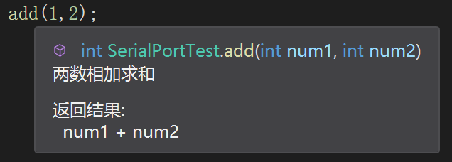

# C# 基础

## 1. C# 简介

* C# 是微软公司发布的一种由 C 和 C++ 衍生出来的面向对象编程语言，是运行于`.NET`平台的高级编程语言。


## 2. .Net 组件

> .net 主要运行在Windows环境，**Mono** 是 .NET 框架的一个开源版本可以运行在Android、Mac、IOS等其他系统环境。

- 公共语言运行库（Common Language Runtime - CLR）
- .Net 框架类库（.Net Framework Class Library）
- 公共语言规范（Common Language Specification）
- 通用类型系统（Common Type System）
- 元数据（Metadata）和组件（Assemblies）
- Windows 窗体（Windows Forms）
- ASP.Net 和 ASP.Net AJAX
- ADO.Net
- Windows 工作流基础（Windows Workflow Foundation - WF）
- Windows 显示基础（Windows Presentation Foundation）
- Windows 通信基础（Windows Communication Foundation - WCF）
- LINQ

## 3. C# 基本语法

### 3.1 基本结构

> C#的文件名和类的名称可以不相同（ 与Java对比）

````c#
using System; 								//引用命名空间
namespace HelloWorldApplication{			//命名空间
   class HelloWorld{						//类
      static void Main(string[] args){		//方法（Main方法是程序执行的开始）
         Console.WriteLine("Hello World");
         Console.ReadKey();
      }
   }
}
````

### 3.2 C# 基本语法

* 在任何 C# 程序中的第一条语句都是：`using System;`

* 特殊注释：`///`

  > 该注释会被编译。
  >
  > 缺点：使用该注释会影响编译速度(但不会影响执行速度)。
  >
  > 优点：使用该注释给函数添加描述后，在其它地方调用该函数时，`<summary>注释内容</summary>`标识内的注释内容能被编译器获取，并展示出来。

  ````c#
  /// <summary>
  /// 两数相加求和
  /// </summary>
  /// <param name="num1"></param>
  /// <param name="num2"></param>
  /// <returns>num1 + num2</returns>
  public int add(int num1, int num2)
  {
      return num1 + num2;
  }
  ````



