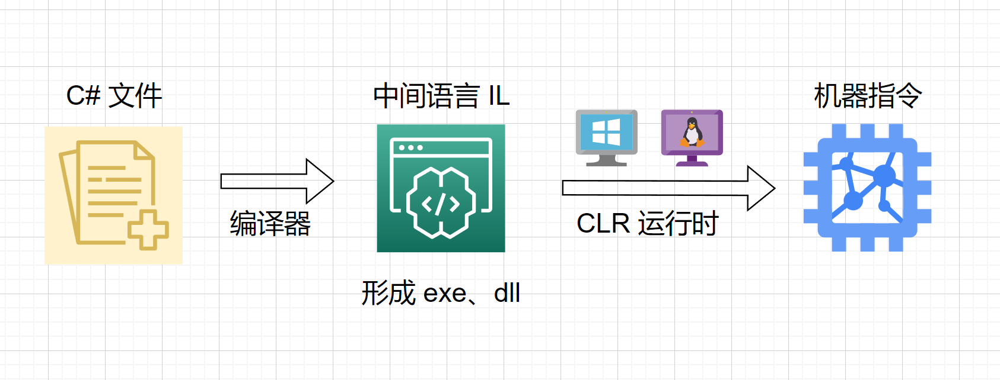

# C# 基本语法

## 1. 程序结构

### 1.1 文件结构

> 解决方案====》项目 ====》类文件、程序集文件

### 1.2 代码结构

> 任意 C# 程序中的第一条语句都是 `using System;` 引用系统命名空间。
>

````c#
using System; 								//引用命名空间
namespace HelloWorldApplication				//命名空间（相当于一个包）
{
   class HelloWorld							//类
   {
      static void Main(string[] args)		//方法（Main方法是程序执行的开始）
      {
         Console.WriteLine("Hello World");
         Console.ReadKey();
      }
   }
}
````

## 2. C# 程序执行过程

① C# 代码经过编译器编译成符合 CLI 规范的[中间语言 (IL)](https://learn.microsoft.com/zh-cn/dotnet/standard/managed-code)

② 编译器根据程序是应用程序还是库程序，将 IL 代码和资源打包成 .exe 或.dll 程序集。

③ 执行时，将 .exe 或.dll 程序集加载到 CLR 中。

④ CLR 会直接执行实时 (JIT) 编译，将 IL 代码转换成本机指令。

> .NET 平台上的其他语言，例如 F#、VB等也是这么执行的。



## 3. C# 标识符

### 3.1 C# 关键字

> 官方文档：[C# 关键字](https://learn.microsoft.com/zh-cn/dotnet/csharp/language-reference/keywords/)

### 3.2 标识符规则

> 标识符必须以字母、下划线 (`_`)或者**`@`**符号 开头
>
> 标识符可以包含 Unicode 字母字符、十进制数字字符、Unicode 连接字符、Unicode 组合字符或 Unicode 格式字符。
>
> 如果标识符的前缀为 `@`，则该标识符可以是 C# 关键字。

### 3.3 命名规范

> 类、命名空间、公共成员、方法、结构等：使用 PascalCase 命名
>
> 局部变量：使用 camelCase 命名方式，例：`string message`。
>
> 接口使用：使用 `I + PascalCase` 命名方式，例：IWorkerQueue
>
> 私有变量：使用 `_ + camelCasing` 命名方式，例：`private IWorkerQueue _workerQueue;`
>
> 静态变量：以 `s_` 开头。 
>
> 避免在名称中使用缩写或首字母缩略词，但广为人知和广泛接受的缩写除外，例如：msg、btn 等。
>
> 使用`反向域名`表示法描述命名空间。

### 3.4 转义字符

常用转义字符：

| 转义字符 | 含义   | 转义字符 | 含义   |
| -------- | ------ | -------- | ------ |
| `\n`     | 换行   | `\r `    | 回车   |
| `\t`     | 制表   | `\\`     | 反斜杠 |
| `\"`     | 双引号 | `\0 `    | 空格   |
| `\a`     | 响铃   |          |        |

### 3.5 进制表示

| 进制     | 表示法           |
| -------- | ---------------- |
| 二进制   | `int i = 0B1101` |
| 十六进制 | `int i = 0X1101` |

### 3.6 数据定义

#### 3.6.1 常量定义

````c#
public const double PI = 3.1415926;//常量
````

#### 3.6.2 变量定义

````c#
//常规定义
public int num1 = 10;

//在局部变量或者脚本中，可以使用var方式定义。
var num2 = 3.20;
````

## 4 注释

注释方式有四种：

* ①单行注释：`//注释内容`  

* ②多行注释：`/*注释内容*/`  

* ③折叠代码注释：`#region` 、 `#endregion`，此方式属于一种预命令。

    ````c#
    #region 折叠注释提示
    //代码内容
    #endregion
    ````

* ④文档注释：`///`

    > 该注释用于给函数、类添加描述，在其它地方调用该函数时可显示注释提示。例如：

    ````c#
    /// <summary>
    /// 两数相加求和
    /// </summary>
    /// <param name="num1"></param>
    /// <param name="num2"></param>
    /// <returns>num1 + num2</returns>
    public int add(int num1, int num2)
    {
        return num1 + num2;
    }
    ````

    

## 5. 控制台输入输出

### 5.1 占位符输出

> 占位符 {}

````C#
int a = 1;
int b = 2;
Console.WriteLine("a值为：{0}，b值为：{1}",a,b);
````
