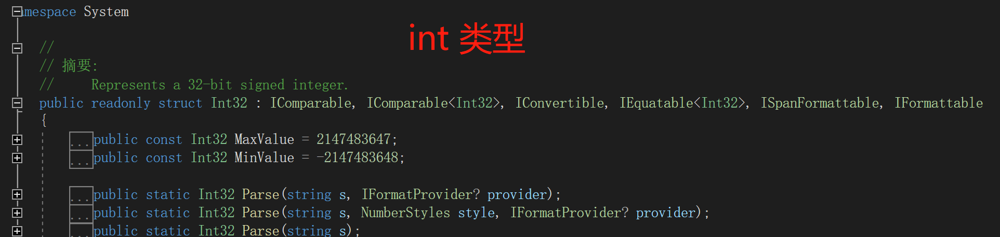
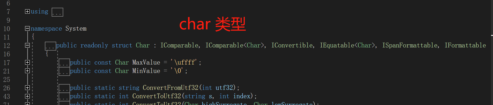

# C# 基本数据类型

> C# 采用统一的类型系统，因此任意类型的值都可视为 `object`。
>
> 每种 C# 类型都直接或间接地派生自 `object` 类类型， `object` 是所有类型的最终基类。

## 1. 值类型介绍

* 值类型的变量直接存储数据值，存储在栈内存中。也称简单数据类型。
* 当将一个值类型变量，复制给领一个值类型变量后，对其中一个变量执行运算不会影响另一个变量（`ref` 和 `out` 参数变量除外）。
* 值类型数据，**System.ValueType** 是值类型的隐藏式基类，**ValueType** 类继承于 **System.Object**。
* C# 的值类型进一步分为：
  * 简单类型
  * 枚举类型
  * 结构类型
  * 可以为 null 的值类型
  * 元组值类型。
  

## 2. 简单值类型

### 2.1 清单

> 1字节(Byte) =  8位(Bit)

| 类型        | 字节数 | 描述                                       | 取值                             | 默认值    | 全称               |
| ----------- | ------ | ------------------------------------------ | -------------------------------- | --------- | ------------------ |
| sbyte       | 1      | 8 位有符号整数                             | -128 到 127                      | 0         | System.SByte       |
| **byte**    | 1      | **8 位无符号整数**                         | 0 到 255                         | 0         | System.Byte        |
| **short**   | 2      | **16 位有符号整数**                        | -32,768 到 32,767                | 0         | System.Int16       |
| ushort      | 2      | 16 位无符号整数                            | 0 到 65,535                      | 0         | System.UInt16      |
| **int**     | 4      | **32 位有符号整数**                        | +- 21.4 亿左右                   | 0         | System.Int32       |
| uint        | 4      | 32 位无符号整数                            | 42.9 亿左右                      | 0         | System.UInt32      |
| nint        | 4/8    | 32 位或 64 位有符号的整数                  | 取决于（在运行时计算的）平台     | 0         | System.IntPtr      |
| nuint       | 4/8    | 32 位或 64 位无符号的整数                  | 取决于（在运行时计算的）平台     | 0         | System.UIntPtr     |
| **long**    | 8      | **64 位有符号整数**                        | -2^63 ~ +(2^63)-1                | **0L**    | System.Int64       |
| ulong       | 8      | 64 位无符号整数                            | 0 ~ 2^64                         | 0         | System.UInt64      |
| **float**   | 4      | 32 位单精度浮点型                          | ±1.5 x 10^−45 至 ±3.4 x 10^38    | **0F**    | System.Single      |
| **double**  | 8      | 64 位双精度浮点型                          | ±5.0 × 10^−324 到 ±1.7 × 10^308  | **0**     | System.Double      |
| **decimal** | 16     | **128 位精确的 十进制值，28- 29 有效位数** | ±1.0 x 10^-28 至 ±7.9228 x 10^28 | **0M**    | System.Decimal     |
| **bool**    |        | 1bit **布尔值**                            | true 、false                     | **false** | **System.Boolean** |
| **char**    | 2      | **16 位 Unicode 字符**                     | U +0000 到 U +fff                | **'\0'**  | **System.Char**    |

### 2.2 特点

* 每个整型类型的默认值都为零 `0`。
* 每个整型类型都有 `MinValue` 和 `MaxValue` 属性，提供该类型的最小值和最大值，这些属性是编译时常量。本机大小类型（`nint` 和 `nuint`）的`MinValue` 和 `MaxValue` 属性除外，它们是在运行时计算的。 
* 值类型在使用时类型关键字可替换成全称，即：`System.Int32 i = 10 ` 等价于 `int i = 10`

### 2.3 decimal 介绍

> decimal 表示 128 位数据有符号小数类型。
>
> 与浮点类型相比，decimal虽然数据位数更多，但是数据范围比浮点数更小。
>
> 不过，deciaml优势是具有更高的精度值，更适合财务货币等高精度计算。

* 初始化

    ````c#
    decimal money = 8.88888888m;//decimal 数字使用 m 或者 M 后缀。
    ````

* 转换

    ````c# 
    decimal money = 8;//当把整型复制给 decimal 时，会自动隐式转换。
    
    double a = 8.88;
    decimal b = (decimal)a;//浮点类型赋值给 decimal 时，需要使用强制转换，否则会报错。
    ````

## 3. 特殊值类型

| 特殊值类型 | 描述                                                  | 全称          |
| ---------- | ----------------------------------------------------- | ------------- |
| enum       | 枚举类型                                              | System.Enum   |
| struct     | 结构体。                                              |               |
| (...)      | 元组                                                  |               |
| T?         | 可空型，基本数据类型加上 ？号，表示可为null类型数据。 | `Nullable<T>` |

### 3.1 枚举

#### 3.1.1 介绍

> 官方介绍：[枚举类型（C# 参考）](https://learn.microsoft.com/zh-cn/dotnet/csharp/language-reference/builtin-types/enum)
>
> 枚举类型的基类是：[System.Enum](https://learn.microsoft.com/zh-cn/dotnet/api/system.enum)，由一组 **整型常量** 组合成的值类型。
>
> 当有一些固定数值需要表示时，相比于使用1，2，3，4数字，使用枚举可提高程序可读性。所以枚举常用来定义一些固定取值范围的数据，如：季节（春、夏、秋、冬）。
>
> 定义一个枚举类型相当于定义了一个确定的整型常量集合，枚举类型变量只能从这些枚举成员中取值。
>

#### 3.1.2 枚举特点

* 枚举成员实质都是整形常量。
* 默认情况下，枚举成员的关联常量值为类型 `int`；它们的默认值从 0 开始，并按定义文本顺序递增 1。
* 可以手动定义枚举类型的关联常量值类型为 `short`、`byte`等其他整形类型。
* 也可修改枚举成员的整型值，当其中一个枚举成员的整型值被修改后，后续的枚举成员在修改后的基础上再以此递增 1。
* 枚举类型可以与整型类型相互强制转换。
* 枚举类型对象的默认值是0。直接输出枚举对象的话，如果该枚举存在值为0的枚举成员，则输出枚举成员；如果不存在的话，则直接输出0；

#### 3.1.3 代码案例

````C# 
public enum Season
{
    Spring,//默认为0,后面以此类推
    Summer,//在前者的基础上+1,整数值为 1
    Autumn = 10,//自定义整形值10。
    Winter //后续数据在前者的基础上+1，整型值变为 11
}
static void Main(string[] args)
{
    //枚举类型的默认值是0
    Season season1 = new Season();
    Console.WriteLine(season1);//输出 Spring，如果枚举成员中不存在为0的成员，那么会输出0

    //赋指定枚举值
    Season season2 = Season.Autumn;
    Console.WriteLine(season2);//输出 Auttum

    //利用强制转换整数寻找指定枚举值
    Season season3 = (Season)1;
    Console.WriteLine(season3);//输出 Summer
    
    //利用强制转换整数寻找指定枚举值
    Season season4 = (Season)10;
    Console.WriteLine(season4);//输出 Autumn，因为被自定义为 10 了
    
    //强制转换失败，还是会输出原整形值。
    Season season5 = (Season)9999;
    Console.WriteLine(season5);//输出 9999，因为枚举体中不存在9999对应的数据。
}
````

````c#
//手动定义枚举类关联的常量值类型
public enum Season:short
{
    Spring,
    Summer,
    Autumn,
    Winter
}
````

### 3.2 结构体

> 官方介绍文档：[结构类型](https://learn.microsoft.com/zh-cn/dotnet/csharp/language-reference/builtin-types/struct)
>
> 结构类型（structure  或者叫 struct ）是一种可 **封装数据** 和 **相关功能** 的 **值类型**。
>
> 结构类型与类相似，但是通常结构类型用来设计一些以数据为中心的较小类型，这些类型只有很少的行为或没有行为；而类则是更侧重于行为。
>
> 由于结构类型具有值语义，因此建议定义不可变的结构类型。在 `struct` 关键字前添加`readonly`修饰符，声明结构类型为不可变。
>
> .NET 中的整型、浮点型、布尔值、Char 以及时间实例都是用结构来设计的。
>
> struct 是值类型数据，存储在栈中。定义过多的话可能会导致栈内存不够。
>
> struct 不能继承
>
> struct 可以实现接口
>
> 
>
> 

例：

````C#
public struct Coords
{
    //定义结构体
    public Coords(double x, double y)
    {
        X = x;
        Y = y;
    }

    public double X { get; set; }
    public double Y { get; set; }

    public override string ToString() => $"坐标：({X}, {Y})";
}
static void Main(string[] args)
{
    Coords coords = new Coords(8.8, 9.9);

    //结构体赋值时，是将原数据原原本本地复制，所以修改 coords2 不会影响 coords1
    Coords coords2 = coords;
    coords2.X = 7.7;

    Console.WriteLine(coords);//坐标：(8.8,9.9)
    Console.WriteLine(coords2);//坐标：(7.7,9.9)
}
````

### 3.3 元组 Tuple

#### 3.3.1 元组介绍

> 官方详细介绍：[元组类型](https://learn.microsoft.com/zh-cn/dotnet/csharp/language-reference/builtin-types/value-tuples)
>
> 元组功能提供了简洁的语法来将 **任意多个数据元素** 组成一个 **轻量数据结构**。格式：(数据1, 数据2, 数据3, ... )
>
> 利用元组，可以不利用类、数组等对象轻松实现一个方法返回多个数据。

#### 3.3.2 元组特点

* 元组数组各字段有默认名称，默认字段名称为 Item1、Item2、Item3...等
* 定义元组时，可以为各字段添加自定义的字段名称。但，即使自定义了字段名称，原默认名称Item1、Item2、Item3...也仍然有效。
* 元组类型也可做为方法的返回值。

#### 3.3.3 定义元组

> 方式一：采用默认的字段名称定义元组。

````c#
(double, int) t1 = (4.5, 3);
Console.WriteLine($"数值1：{t1.Item1}，数值2 {t1.Item2}.");//使用默认字段名称来访问
````

> 方式二：采用自定义字段名称定义元组

````c#
(double Sum, int Count) t2 = (4.5, 3);
Console.WriteLine($"Sum of {t2.Count} elements is {t2.Sum}.");//使用自定义名称访问
Console.WriteLine($"数值1：{t2.Item1}，数值2 {t2.Item2}.");//默认名称仍然有效
````

> 方式三：利用 var 定义元组

```c#
var t3 = (4.5, 3);
Console.WriteLine($"数据1：{t3.Item1}，数据2： {t3.Item2}。");

var t4 = (Num1:5, Num2:6);
Console.WriteLine($"数据1：{t4.Num1}，数据2： {t4.Num2}。");
```

> 方式4：元组投影初始值设定项：
>
> 如果未指定字段名称，则可以根据元组初始化表达式中相应变量的名称推断出此名称。但，在以下情况下，变量名称不会被投影到元组字段名称中:
>
> * 候选名称是元组类型的成员名称，例如 Item3、ToString 或 Rest。
> * 候选名称是另一元组的显式或隐式字段名称的重复项。

````c#
var sum = 4.5;
var count = 3;
var t = (sum, count);//保险起见可以写成：var t = (sum:sum, count:count);
Console.WriteLine($"Sum of {t.count} elements is {t.sum}.");
````

#### 3.3.4 元组作为返回值

> 元组类型可以用作函数的返回类型，这样可以同时可以返回多个数据。

````c#
 static void Main(string[] args)
 {
     int[] numArr = { 1, 2, 3, 4, 5 };
     (int min,int max) result = FindMinMax(numArr);//也可用 var 关键字来确定。
     Console.WriteLine(result.min);
     Console.WriteLine(result.max);
 }

 public static (int, int) FindMinMax(int[] input)
 {
     if (input is null || input.Length == 0)
     {
         throw new ArgumentException("输入的数组为空！");
     }

     var min = int.MaxValue;
     var max = int.MinValue;
     foreach (var i in input)
     {
         if (i < min)
         {
             min = i;
         }
         if (i > max)
         {
             max = i;
         }
     }
     return (min, max);
 }
````

#### 3.3.5 元组比较

> 元组类型支持相等运算符 `==` 和 `!=`，只会比较值，字段名称不同不影响比较结果。

````c#
var tuple1 = (1, 5);
var tuple2 = (1, 5);
var tuple3 = (num1:1, num2:5);

int a = 1;
int b = 5;
var tuple4 = (a, b);

Console.WriteLine(tuple1 == tuple2);//True
Console.WriteLine(tuple1 == tuple3);//True
Console.WriteLine(tuple1 == tuple4);//True

var c = (1.22, 1.000);
var d = (1.22f, 1.000);
Console.WriteLine(a == b);//False,因为第一个字段的数据类型不同
````

#### 3.3.5 不同的元组

**System.ValueTuple ** 类型和 **System.Tuple** 类型下都有元组。 主要区别如下：

- `System.ValueTuple` 类型是值类型。 `System.Tuple` 类型是引用类型
- `System.ValueTuple` 类型是可变的。 `System.Tuple` 类型是不可变的。
- `System.ValueTuple` 类型的数据成员是字段。 `System.Tuple` 类型的数据成员是属性。

#### 3.3.7 元组别名

> 从 C# 12 开始，可以使用 using 指令为元组类型取别名，这样在将元组作为方法返回值时，可读性更高。

### 3.4 可为 null 类型

> 官方详细解读：[可为空的值类型(C# 参考)](https://learn.microsoft.com/zh-cn/dotnet/csharp/language-reference/builtin-types/nullable-value-types?redirectedfrom=MSDN)

* 普通值类型只能赋值该类型取值范围内的数据，例如 `bool` 类型 只能设置值 `true` 或者 `false`。在普通值类型后加一个 ？号，即可表示为可为 null 类型。
* 可为 null 类型，除了可被赋值原本取值范围的数据外，还可被赋值为 null 。

* 可为 null 类型内置方法：

    * `HasValue` 属性，判断是否有值。

    * `Value` 属性，获得可为 null 类型的值，如果值是 null 的话，调用此属性会报异常。

    * `GetValueOrDefault()` 方法，获得可为 null 类型的值，如果值是 null 的话，则会返回对应基本类型的默认值。

    * `GetType()` 方法，获得对应的基本类型，如果值为 null 的话，调用此方法会报异常。

例：

````c#
//使用 is 来判断数据类型
int? a = 42;
if (a is int valueOfA)
{
    Console.WriteLine($"a is {valueOfA}");
}
else
{
    Console.WriteLine("a does not have a value");
}
````

****

End
