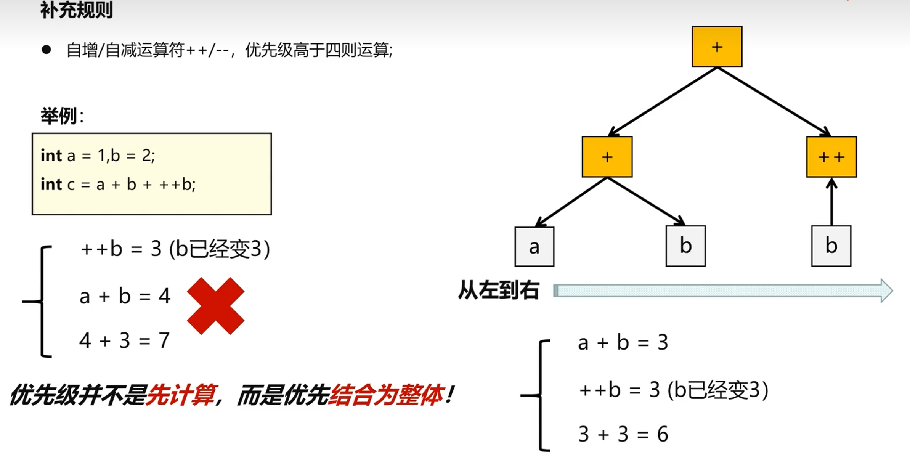
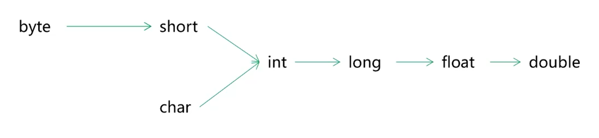

# 运算与数据转换

## 1. 运算

### 1.1 自增自减        

> 自增自减优先级问题



例：

```C#
int a = 1,b = 2,c = 3;
int d = a + b * c / 2 + ++a + a;
Console.WriteLine(d);//8
```

### 1.2 null 合并

> null 合并运算符。
>
> 对于一些可空基本类型进行可空判断，如果运算符左侧的数据为 null 则会返回运算符右侧的数据。

````c#
int? a = null;
Console.WriteLine(a ?? 2);
````

### 1.3 位运算

> 实际应用层写代码不常用

| 运算符 | 名称       | 效果                                  |
| ------ | ---------- | ------------------------------------- |
| &      | 位与       | 有0即为0，全1才为1                    |
| \|     | 位或       | 有1即为1，全0才为0                    |
| ^      | 位异或     | 全0或全1才为0                         |
| ~      | 取反       | 1变0，0变1，包括符号位                |
| <<     | 二进制左移 | 二进制数左移n位，相当于乘以2的n次方。 |
| >>     | 二进制右移 | 二进制数右移n位，相当于除以2的n次方。 |

### 1.4 逻辑运算

| 运算符 | 效果                                                         |
| ------ | ------------------------------------------------------------ |
| &      | A & B，会同时计算并判断A、B表达式的结果。同为 ture 结果才为true。 |
| \|     | A \| B，会同时计算并判断A、B表达式的结果。同为 false 结果才为false。 |
| &&     | A && B，同为 ture 结果才为 true。当A确定为 false 时，不会计算表达式B，结果已确认为 false。 |
| \|\|   | A \|\| B，同为 false 结果才为 false。当A确定为 true 时，不会计算表达式B，结果已确认为 true。 |
| !      | 真变假，假变真                                               |

### 1.5 其他运算符

| 运算符 | 作用                                                       |
| ------ | ---------------------------------------------------------- |
| sizeof | 获取数据类型字节数大小                                     |
| typeof | 返回 class 对象的类型                                      |
| *      | 变量指针                                                   |
| is     | 判断对象是否时某一类型                                     |
| as     | 强制转换对象，如果不能转换不也不会报异常，而是以null代替。 |

````c#
//C# 8.0 is 的特殊用法
object obj = 3.14m;

if (obj is decimal d)//在判断的同时，还可以创建一个变量去接收数据。
{
	Console.WriteLine(d);
}

````

## 2. 运算符优先级

| 类别       | 运算符                                       | 结合性       |
| ---------- | -------------------------------------------- | ------------ |
| 后缀       | () [] -> . ++ - -                            | 从左到右     |
| 一元       | \+ - ! ~ ++ - - (type)* & sizeof             | **从右到左** |
| 乘除       | \* / %                                       | 从左到右     |
| 加减       | \+ -                                         | 从左到右     |
| 移位       | << >>                                        | 从左到右     |
| 关系       | < <= > >=                                    | 从左到右     |
| 相等       | == !=                                        | 从左到右     |
| 位与 AND   | &                                            | 从左到右     |
| 位异或 XOR | ^                                            | 从左到右     |
| 位或 OR    | \|                                           | 从左到右     |
| 逻辑与 AND | &&                                           | 从左到右     |
| 逻辑或 OR  | \|\|                                         | 从左到右     |
| 条件       | ?:                                           | **从右到左** |
| 赋值       | =、+=、-=、*=、/=、%+、>>=、<<=、&=、^=、\|= | **从右到左** |
| 逗号       | ,                                            | 从左到右     |

## 3. 数据类型转换

### 3.1 隐式转换

* 小取值范围类型可以隐式转换为大取值范围类型。

    

    注：取值范围不等价于字节大小，例如 `long` 类型数据的字节数大于 `float` 类型的字节数，但是 `float` 采用的是科学计数表示法，所以其取值范围大于 `long` 类型，固 `long` 类型数据可以隐式转换为 `float` 类型数据。

* **无符号**类型 不能接纳 **有符号**类型 数据。

* 取值范围小的数与取值范围大的数进行运算，取值范围小的数会先被隐式转换为取值范围大的数，再进行运算。

    注：byte、short、char进行运算时，会先隐式转换为 int 类型，最终得到一个int类型数据。

    ````c#
    byte a = 1;
    byte b= 2;
    
    byte c = a + b;//编译器会报错，因为 a+b 类型已经被提升为 int 类型了，无法隐式转换为byte
    Console.WriteLine(c);
    ````

### 3.2 强制转换

* 使用括号`()`强制转换。

    浮点型强制转换为整型时，小数部分会被直接抛弃，发生截断现象。

* 使用 `Convert.toXxx(data)`方法，可以将任意数据转换为任意类型，如果无法转换成功，则报错。

### 3.3 对象类型转换

* 使用 `as` 关键字，如果无法被转换，那么会转换成 null

## 4. 装箱和拆箱

> 装箱指：值类型数据 转换成 引用类型数据。
>
> 拆箱指：引用类型数据 转换成 指类型数据。
>
> 注：装箱和拆箱，涉及栈内存中的数据与堆内存中的数据之前的相互复制拷贝，所以频繁操作会比较消耗内存资源，日常程序应该避免频繁装箱与拆箱。

````c#
//下方代码发生3次装箱，1次拆箱。
int i=0;
System.Object obj=i;
Console.WriteLine(i+","+(int)obj);
````

