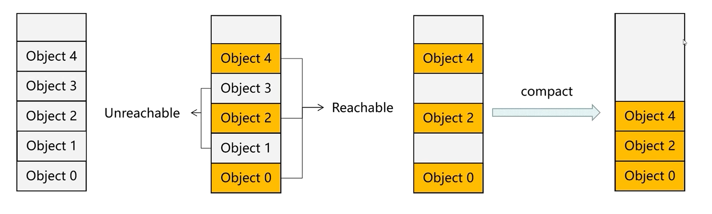

# 垃圾回收

## 1. 垃圾回收相关概念

### 1.1 内存管理

> 内存管理是指用户为变量在堆上分配内存后，谁来管理以及怎么管理释放问题。

* C++、C 程序员手动管理  。
* C#、Java、Python、JS 语言运行时自动管理。

### 1.2 .NET 资源分类

> 在.NET中，资源可以分为两大类：托管资源和非托管资源。

#### 1.2.1 托管资源

> 托管资源（Managed Resources）：是由.NET运行时直接管理的资源。
>
> 这些资源主要是指内存中的对象，它们的生命周期由垃圾回收器控制。
>
> 当没有任何引用指向这些对象时，垃圾回收器会在某个时刻自动释放这些对象所占用的内存。
>
> 这个过程是自动的，开发者通常不需要手动释放这些托管对象占用的内存。

#### 1.2.2 非托管资源

> 非托管资源（Unmanaged Resources）是.NET运行时不直接管理的资源。
>
> 这些资源包括文件句柄、数据库连接、网络套接字、窗口句柄以及任何其他通过操作系统API创建的资源。
>
> 这些资源不是由垃圾回收器控制的，因此它们的生命周期需要开发者显式地管理和释放。
>
> 如果不进行妥善的处理，非托管资源可能会导致资源泄露和内存泄露。

#### 1.2.3 区分方式

* **类型和来源**：

> 通常，.NET类库中的资源（比如.NET对象或类的实例）都是托管资源。
>
> 那些你需要通过平台调用（P/Invoke）访问的、位于.NET框架之外的操作系统资源，如Windows API或其他本地库提供的资源，都是非托管资源。

* **内存管理**：

> 如果资源的内存分配和释放由垃圾回收机制自动处理，则资源是托管的。
>
> 如果你需要手动释放资源或调用特定的方法来清理，那么它通常是非托管的。

* **生命周期**：

> 托管资源的生命周期完全由垃圾回收器控制。
>
> 非托管资源需要开发者或者某些清理机制（比如`IDisposable`接口）来管理。

* **其他**

> 非托管资源对象，一般都会实现 IDisposable 接口。

### 1.3 垃圾回收

> 垃圾回收即通过一定算法，得到内存中哪些对象需要被回收，并在GC阶段将垃圾对象的回收过程。
>
> 逻辑：
>
> 从程序的根对象 root 开始，层层遍历在堆上分配的对象，不再被引用到的对象即判定为垃圾。可被引用到的对象称为Rachable Object;
>
> Root 对象有如下四种：
>
> * 全局对象
> * 静态变量
> * 栈上现存变量
> * CPU 寄存器中的变量

## 2. 垃圾回收算法

### 2.1 标记压缩算法

> 标记压缩算法 Mark-Compac，是C# 所采用的垃圾回收算法。
>
> 具体分为两个阶段，即 `Mark` 标记 与 `Compact` 压缩



* 阶段1：标记清除阶段**(Mark-Sweep)**

    ①最初设定所有对象都不可到达 Unreachable (即没有引用，可以回收）；

    ②从程序各个根对象开始查找，找出有引用的对象，标记为可到达的 Reachable 即要用的不可清除。

    ③清除所有 Unreachable 不可到达的垃圾对象。

* 阶段2：压缩阶段(Compact)

    ① 因为经过清除阶段，清除了各种无用对象后，剩余的有用对象存放位置可能就不连续了。

    为了更好的腾出可使用空间，会将剩余的有用对象在堆中压缩，使其地址紧凑连续分布。

    ② 引用地址修复：压缩会修改堆中对象的存放地址，所以得修复引用对象在栈中的引用、CPU寄存器变量引用以及堆中引用。

### 2.1 分代算法

> 一个运行起来的程序，可能会有几百M到几G的内存，全部扫描并且压缩会有巨大的操作成本;
>
> 所以，GC的触发逻辑，还采用了一种算法——**分代算法（Generational）**。
>
> 分代算法具有一定的统计学基础，即根据程序运行的统计分布规律得出结果。

**分代算法基于的常识：**

> 1、大量新创建的对象生命周期都比较短、而较老对象声明周期则一般较长。
>
> 2、对部分内存进行垃圾处理，相比对于整个程序进行全部垃圾处理操作要快。

**分带算法逻辑**

* ①将对象分为三个年龄阶段：幼年代(或新生代)(gen0)、青年代(gen1)、老年代(gen2)。
* ②程序启动时，在程序内存中分别划分出存储这三种类型对象的区域，并给出预算（Budget）大小容量。幼年代区最小、老年代区最大。各个代区内存超范围预算返回时，就执行GC。
* ③最开始创建的对象都为新生代，存储在新生代区。
* ④当执行了GC之后，新生代区容量不足，无法继续存储新生代对象时，原来在新生代区经历过GC且仍然有用的对象就会被升级为青年代、移动存放到青年代内存区存放。
* ⑤以此类推，当执行了GC之后，青年代区容量也不足之后，原来在青年代区经历过GC且让然有用的对象，就会被升级为老年代，移动存放到老年代内存区。
* 根据容量大小，以及平台GC规则，不同代区的执行频率也会不同，这样就不用每次都对所有对象执行GC，可以实现分区执行。

## 3. 析构方法

### 3.1 介绍

> 在.NET中，析构方法（也称作终结器）是一个用来执行清理操作的特殊方法，用于在对象被 GC垃圾回收前释放非托管资源。
>
> 当.NET运行时的垃圾回收器确定一个对象已经没有任何的引用指向它时，这个对象将成为垃圾收集的候选对象。在收集对象之前，如果该对象有析构方法，它会首先被放到一个叫做终结器队列（finalizer queue）的特殊列表中。运行时会在一个单独的线程中调用这个队列中对象的析构方法，此后，对象实际占用的内存才会被释放。
>
> 析构方法与 C++ 中的析构函数或 Java 中的 `finalize`方法类似，但在.NET中，其执行时机是由垃圾回收器控制的，因此你无法精确地预知析构方法会在什么时候被调用。

### 3.2 定义方式

> 析构方法的定义方式如下：在C#中用波浪线（~）后跟类名的形式来定义。
>
> 它们不能有参数，也不能有访问修饰符或返回类型。

```c#
public class MyClass
{
    // 析构方法
    ~MyClass()
    {
        // TODO: 在这里放置清理非托管资源的代码
    }
}
```

> 依赖于析构方法来清理资源并不是一种好的实践，有几个原因：
>
> 1. 终结器的执行时间不确定：你无法确知析构方法具体何时被调用。
> 2. 终结器可能导致延迟释放资源：因为GC对象的方式而不是立即的，非托管资源可能会长时间占用。
> 3. 终结器会增加性能开销：当对象有析构方法时，它们的垃圾回收过程需要更多的步骤，并且会使对象存活更久。
>
> 通常建议使用`IDisposable`接口和`Dispose`方法来手动释放持有的非托管资源。

## 4. IDisposable 接口

### 4.1 介绍

> 在 .NET 中，`IDisposable` 接口是一种处理资源释放的标准方式，它的目的是提供一个机制，让开发者能显式地释放对象所持有的非托管资源（例如文件句柄、数据库连接、网络连接等）。

`IDisposable` 接口定义了一个方法，`Dispose`：

```c#
public interface IDisposable
{
    void Dispose();
}
```

> 实现者需要在`Dispose`方法的实现中写上清理资源的代码。调用`Dispose`方法通常是在使用完非托管资源之后，确保这些资源被及时释放。

### 4.2 实践案例

> 通过`IDisposable`接口，可以控制资源释放的时间，这是与靠GC和析构方法释放资源相比更优的选择。当实现了`IDisposable`接口后，通常会将析构方法与`Dispose`模式一起使用，以确保非托管资源即使在使用者忘记调用`Dispose`的情况下也能被释放。

下面是一个实现了`IDisposable`接口的简单类的例子：

```C#
public class MyResource : IDisposable
{
    private bool disposed = false; // 用于跟踪资源是否已释放

    // 实现 IDisposable 接口的 Dispose 方法
    public void Dispose()
    {
        Dispose(true);
        GC.SuppressFinalize(this); // 防止垃圾回收器调用对象的终结器
    }

    protected virtual void Dispose(bool disposing)
    {
        if (!disposed)
        {
            if (disposing)
            {
                // 释放托管资源
            }

            // 释放非托管资源
            
            disposed = true;
        }
    }

    // 析构器（终结器）
    ~MyResource()
    {
        Dispose(false);
    }
}
```

> 在这个例子中：
>
> 1. 实现了`Dispose`方法以使得使用者能显式释放资源。
> 2. 使用了一个保护模式的`Dispose(bool disposing)`方法，这样做能区别直接调用`Dispose`和析构器调用`Dispose`的情况。
> 3. 在`Dispose`中调用了`GC.SuppressFinalize(this)`来阻止垃圾回收器调用析构器，因为资源已经被释放，不需要额外的终结操作。

此模式允许类的消费者通过代码显式地管理资源的释放，并且还提供了一个安全网，以防它们忘记这么做。

如果`Dispose`没有被显式地调用，垃圾回收器最终会调用析构器，进而调用`Dispose(false)`做最后的资源清理。

实现`IDisposable`接口并遵循上述模式来处理资源释放，在编写拥有资源管理职责的类时是一种最佳实践。

## 5. using 自动释放

### 5.1 介绍

> 在.NET中，`using`语句是一种语法糖，它确保了在代码块执行完毕后，作用域中的资源会自动被释放。
>
> 这主要用于那些实现了`IDisposable`接口的对象，如文件流、数据库连接等，进而保证即使在发生异常的情况下这些对象的`Dispose`方法也能被调用，以便正确地清理资源。

### 5.2 定义方式

**传统方式：**

> 这里`ResourceType`代表了任意一个实现了`IDisposable`接口的类。当控制流退出`using`块时，不管是正常退出还是由于异常退出，都会自动调用`resource`对象的`Dispose`方法来释放资源。

```c#
using (ResourceType resource = new ResourceType())
{
    // 在这里使用resource资源
}
// 代码块结束后，resource.Dispose()会被自动调
```

**C# 8.0开始新语法：**

> 引入了一个新的`using`声明，使得代码更加简洁，称作"简化的`using`语句"（using declaration）。
>
> 不再需要显式的代码块，资源的释放会在包含该声明的方法结束或者代码块结束时发生。

```c#
using ResourceType resource = new ResourceType();
// 在这里使用资源
```

在这个版本中，`resource`仍然会在其作用域结束时被自动释放，即使没有明确的`using`代码块。这种方式简化了代码，并减少了因忘记添加大括号而导致资源未被释放的风险。

需要注意的是，使用`using`声明时，确保没有任何其他代码需要在资源释放后访问那个资源，因为一旦变量`resource`所在的作用域结束，`Dispose`会被自动调用。