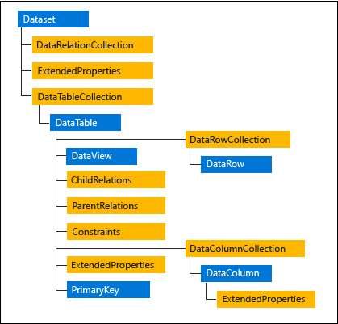

# ADO.NET 基础使用

> 官网地址：[AOD.NET 概述](https://learn.microsoft.com/zh-cn/dotnet/framework/data/adonet/ado-net-overview)

## 1. AOD.NET 介绍

> ADO.NET 是一组向 .NET Framework 程序员公开数据访问服务的类。
>
> ADO.NET 除了处理数据库的访问，也支持用于处理本地的XML数据。

> ADO.NET 类位于 System.Data.dll 中，并与 System.Xml.dll 中的 XML 类集成。

> ADO.NET 优缺点:
>
> 优点：执行效率高，相比于任何的ORM框架，ADO.NET 作为原装的直接跟数据库打交道，直接操作数据库，没有进行额外的封装，执行速度非常快。
>
> 缺点：使用时需要手动编写SQL语句，开发效率相对较慢，缺乏面向对象思想。

## 2. DbConnection 连接对象

> DbConnection 数据库连接对象用于与数据库建立连接。 不同数据库所使用的连接对象也不同，这些连接对象类都实现了 IDbConnection 接口。

| 数据库        | Connection 连接对象类 |
| ------------- | --------------------- |
| **SqlServer** | **SqlConnection**     |
| MySql         | MySqlConnection       |
| Oracle        | OracleConnection      |

### 2.1 SqlConnection 类

> 官方文档：[SqlConnection 类](https://learn.microsoft.com/zh-cn/dotnet/api/system.data.sqlclient.sqlconnection?view=dotnet-plat-ext-6.0)
>
> 命名空间: System.Data.SqlClient
>
> 程序集: System.Data.SqlClient.dll (需要 NuGet 包管理器引用)

#### 2.1.1 构造方法

| 构造方法                             | 描述                                                       |
| ------------------------------------ | ---------------------------------------------------------- |
| SqlConnection()                      | 初始化 SqlConnection 类实例。                              |
| SqlConnection(String)                | 初始化 SqlConnection 类实例，并设置连接属性。              |
| SqlConnection(String, SqlCredential) | 设置连接属性时，使用 SqlCredential  加密账号密码。(不常用) |

#### 2.1.2 常用属性

| 属性              | 描述                                               |
| ----------------- | -------------------------------------------------- |
| ConnectionString  | 连接字符串                                         |
| ConnectionTimeout | （只读）连接超时等待的时间（以秒为单位，默认15秒） |
| State             | （只读）连接状态                                   |
| DataSource        | （只读）当前数据库服务器地址                       |
| Database          | （只读）当前连接的数据库                           |
| ServerVersion     | （只读）当前客户端的SQL Sever版本                  |

#### 2.1.3 数据库连接设置

**ConnectionString 基础格式（配置项名不区分大小写）：**

````c#
"Data Source=xx; Initial Catalog=xx; User ID=xx; Password=xx;Connect Timeout=xx;"
````

| 必填配置        | 配置别名            | 必填   | 描述       |
| --------------- | ------------------- | ------ | ---------- |
| Data Source     | server 或者 address | **是** | 服务器地址 |
| User ID         | uid 或者 username   | **是** | 数据库账号 |
| Password        | pwd                 | **是** | 数据库密码 |
| Initial Catalog | database            | **是** | 数据库名称 |

| 其他配置                           | 默认值 | 描述                                                         |
| ---------------------------------- | ------ | ------------------------------------------------------------ |
| **Application Name**               | 无     | 指定连接的应用程序名称。                                     |
| Connect Timeout（别名**timeout**） | 15     | 连接超时时间(秒)                                             |
| **Pooling**                        | true   | 是否启用连接池应。                                           |
| **Min Pool Size**                  | 0      | 指定连接池中最小连接数的大小                                 |
| **Max Pool Size**                  | 100    | 指定连接池中最大连接数的大小                                 |
| Integrated Security                | true   | 指定是否使用 Windows 集成安全性进行身份验证                  |
| Encrypt 或 SSL                     | false  | 指定是否使用加密连接                                         |
| TrustServerCertificate             | false  | 指定是否信任服务器证书，用于加密连接                         |
| MultipleActiveResultSets           | false  | 指定是否启用多个活动结果集（Multiple Active Result Sets, MARS）支持 |

#### 2.1.4 常用方法

| 方法                                    | 描述                                                        |
| --------------------------------------- | ----------------------------------------------------------- |
| Open()                                  | 使用由 ConnectionString 指定的属性设置打开一个 数据库连接。 |
| Close()                                 | 关闭与数据库之间的连接。                                    |
| Dispose()                               | 用于释放对象持有的非托管资源。                              |
| BeginTransaction()                      | 开始数据库事务。                                            |
| BeginTransaction(IsolationLevel)        | 以指定的隔离级别启动数据库事务。                            |
| BeginTransaction(IsolationLevel,string) | 以指定的隔离级别和事务名称启动数据库事务。                  |
| CreateCommand()                         | 创建并返回与 SqlConnection 关联的 SqlCommand 对象。         |

**Close() 方法和 Dispose() 方法区别**

> 1. `Close()` 方法：
>     * `Close()` 方法是 SqlConnection 对象的成员方法，用于显式关闭数据库连接。
>     * 当调用 `Close()` 方法时，连接对象仍然存在，可以使用它重新打开连接。
>     * 关闭连接后，连接对象仍然可用，可以再次打开并使用。
>     * 在使用完数据库连接后，建议调用 `Close()` 方法以及适时的 `Dispose()` 方法来释放资源。
> 2. `Dispose()` 方法：
>     * `Dispose()` 方法是 IDisposable 接口的一部分，用于释放对象持有的非托管资源。
>     * 在使用完数据库连接后，应该使用 `Dispose()` 方法来释放资源。
>     * `Dispose()` 方法将关闭连接并释放相关资源，将连接对象置于已释放的状态。
>     * 调用 `Dispose()` 方法后，连接对象将不再可用，任何尝试再次打开它将引发异常。
>
> 通常情况下，推荐在使用完数据库连接后立即调用 `Dispose()` 方法，以确保及时释放资源。
>
> 如果要稍后重新使用连接，可以使用 `Close()` 方法来暂时关闭连接，并在需要时再次打开。

#### 2.1.5 代码案例

**使用有参构造创建连接**

````c#
//连接参数
string connectionString = "server=xxxx;database=xxxx;uid=sa;pwd=xxxxx;";
//创建连接
SqlConnection connection = new SqlConnection(connectionString);
//打开连接
connection.Open();
//读取连接相关数据
Console.WriteLine($"State={connection.State}");
Console.WriteLine($"DataBase={connection.Database}");
Console.WriteLine($"ServerVersion={connection.ServerVersion}");
Console.WriteLine($"DataSource={connection.DataSource}");
Console.WriteLine($"ConnectionTimeout={connection.ConnectionTimeout}");
//关闭连接
connection.Close();
````

## 3. DbCommand 命令对象

> DbCommand 命令对象代表了数据库执行的一个命令或者操作，例如 Transact-SQL 语句或存储过程。 
>
> 不同数据库所使用的命令对象也不同，这些对象的类都实现了IDbCommand接口。

| 数据库        | Command 命令对象 |
| ------------- | ---------------- |
| **SqlServer** | **SqlCommand**   |
| MySql         | MySqlCommand     |
| Oracle        | OracleCommand    |

### 3.1 SqlCommand 类

> 官方文档：[SqlCommand 类](https://learn.microsoft.com/zh-cn/dotnet/api/system.data.sqlclient.sqlcommand?view=dotnet-plat-ext-6.0)
>
> 命名空间：System.Data.SqlClient
>
> 程序集：System.Data.SqlClient.dll

#### 3.1.1 构造方法

| 构造方法                                        | 方法描述                                |
| ----------------------------------------------- | --------------------------------------- |
| SqlCommand()                                    | 无参构造                                |
| SqlCommand(String)                              | 带SQL操作语句的构造                     |
| SqlCommand(String,SqlConnection)                | 带SQL操作语句以及连接对象的构造         |
| SqlCommand(String,SqlConnection,SqlTransaction) | 带SQL操作语句、连接对象、事务控制的构造 |

#### 3.1.2 常用属性

| 属性           | 描述                                                    |
| -------------- | ------------------------------------------------------- |
| CommandText    | 要在数据源中操作的 Transact-SQL 语句、表名或存储过程。  |
| CommandTimeout | 执行命令并生成错误之前的等待时间（以秒为单位）。        |
| CommandType    | 获取或设置一个值，该值指示解释 CommandText 属性的方式。 |
| Connection     | 命令操作所属的连接对象                                  |
| Parameters     | 命令参数                                                |
| Transaction    | 操作所使用的事务                                        |

#### 3.1.3 常用方法

| 方法              | 描述                                                         |
| ----------------- | ------------------------------------------------------------ |
| Cancel()          | 取消执行                                                     |
| CreateParameter() | 创建参数对象                                                 |
| Dispose()         | 释放资源                                                     |
| ExecuteNonQuery() | 执行命令，返回受影响的行数。**用于增、删、改数据**。         |
| ExecuteScalar()   | 执行命令，并返回查询所返回的结果集中第一行的第一列。**用于查询单个数据**。 |
| ExecuteReader()   | 将命令送到连接的数据库，并生成 SqlDataReader流。**用于查询表格数据**。 |

#### 3.1.4 代码案例

**使用无参构造：**

````c#
//设置连接参数
String connectString = "server=xxxx;database=xxxx;uid=sa;pwd=xxxxx;";
//创建连接对象（使用using自动释放）
using SqlConnection connection = new SqlConnection(connectString);
//打开连接
connection.Open();
//创建命令对象
String sqlString = $"INSERT INTO dbo.account(NAME,balance) VALUES('王五',1000)";
using SqlCommand command = new SqlCommand();
command.CommandText = sqlString;
command.Connection = connection;
//执行命令,获取执行结果
int num = command.ExecuteNonQuery();
Console.WriteLine(num);
````

**利用 Connection 对象创建与之相关的 Command 对象：**

````c#
···
using SqlCommand command = connection.CreateCommand();
command.CommandText = $"INSERT INTO dbo.account(NAME,balance) VALUES('王五',1000)";
···
````

**使用有参构造（推荐）**

````c#
//设置连接参数
String connectString = "server=xxxx;database=xxxx;uid=sa;pwd=xxxxx;";
//创建连接对象（使用using自动释放）
using SqlConnection connection = new SqlConnection(connectString);
//打开连接
connection.Open();
//创建命令对象
String sqlString = $"INSERT INTO dbo.account(NAME,balance) VALUES('王五',1000)";
using SqlCommand command = new SqlCommand(sqlString,connection);
//执行命令,获取执行结果
int num = command.ExecuteNonQuery();
Console.WriteLine(num);
````

## 4. DbDataReader 读取对象

> DbDataReader 数据读取对象，用于从数据库读取数据，这个类提供了一种高性能的方法来读取前向（只能前进不能后退）的数据流。

> 特点：
>
> * 只向前读，顺序访问；
> * 程序和数据库建立了一个流，以流的方式读取数据而非全部加载到内存中。
> * 读取数据的过程，一直与数据库保存着连接，也称为**连接模式数据读取**。
> * 减少了内存消耗，适合处理大量数据。

> 注：DataReader 对象在用完时，要手动关闭释放资源，以便 Connection 对象能进行其它操作。

### 4.1 sqlDataReader 类

官方文档：[sqlDataReader](https://learn.microsoft.com/zh-cn/dotnet/api/system.data.sqlclient.sqldatareader?view=dotnet-plat-ext-6.0)

命名空间：System.Data.SqlClient

程序集：System.Data.SqlClient.dll

#### 4.1.1 常用属性

| 属性              | 描述                                                         |
| ----------------- | ------------------------------------------------------------ |
| Connection        | 获取与DataReader对象相关联的Connection连接对象               |
| Depth             | 获取当前行的嵌套深度                                         |
| FieldCount        | 获取当前行中的列数。                                         |
| HasRows           | 获取一个值，该值指示 [SqlDataReader](https://learn.microsoft.com/zh-cn/dotnet/api/system.data.sqlclient.sqldatareader?view=dotnet-plat-ext-6.0) 是否包含一行还是多行。 |
| IsClosed          | 检索一个布尔值，该值指示是否已关闭指定的 [SqlDataReader](https://learn.microsoft.com/zh-cn/dotnet/api/system.data.sqlclient.sqldatareader?view=dotnet-plat-ext-6.0) 实例。 |
| Item[Int32]       | 在给定列序号的情况下，获取指定列的以本机格式表示的值。       |
| Item[String]      | 在给定列名称的情况下，获取指定列的以本机格式表示的值。       |
| RecordsAffected   | 获取执行 Transact-SQL 语句所更改、插入或删除的行数。         |
| VisibleFieldCount | 获取 [SqlDataReader](https://learn.microsoft.com/zh-cn/dotnet/api/system.data.sqlclient.sqldatareader?view=dotnet-plat-ext-6.0) 中未隐藏的字段的数目。 |

#### 4.1.2 常用方法

| 方法               | 描述                                                         |
| ------------------ | ------------------------------------------------------------ |
| Close()            | 关闭流连接                                                   |
| Dispose()          | 释放该对象资源                                               |
| GetName(int32)     | 获取指定列的名称。                                           |
| GetOrdinal(String) | 在给定列名时获取相应的列序号。                               |
| Read()             | 让 [SqlDataReader](https://learn.microsoft.com/zh-cn/dotnet/api/system.data.sqlclient.sqldatareader?view=dotnet-plat-ext-6.0) 前进到下一条记录。 |
| GetValue(Int32)    | 获取指定列以本机格式表示的值。                               |

#### 4.1.3 代码案例

````c#
//设置连接参数
String connectString = "server=xxxx;database=xxxx;uid=sa;pwd=xxxxx;";
//创建连接对象（使用using自动释放）
using SqlConnection connection = new SqlConnection(connectString);
//打开连接
connection.Open();
//创建命令对象
String sqlString = "select * from account";
using SqlCommand command = new SqlCommand(sqlString,connection);
//创建DataReader对象
using SqlDataReader dataReader = cmd.ExecuteReader();
//读取数据
while (dataReader.Read())
{
    object id = dataReader.GetValue("id");// 也可以使用dataReader[0];dataReader[1];
    object name = dataReader.GetValue("name");
    object balance = dataReader.GetValue("balance");
    Console.WriteLine($"id: {id}\t name: {name}\t price: {balance}\t \n");
}
````

## 5. DbDataAdapter 据读取对象

> DbDataAdapter用于在 `DataSet` 或 `DataTable` 和数据库之间填充数据以及更新数据库。

> 特点：
>
> * DbDataAdapter充当了一个桥梁，连接了数据库与客户端内存中的数据容器（`DataSet` 或 `DataTable`）。
>
> * DbDataAdapter 读取数据是一次性读取，一次连接取得数据后即断开连接，取得数据后将数据存储在内存中，后续在内存中操作数据，所以适配器模式也被称为**断开模式**。
> * 这种处理方式通常适用于操作较小的数据集合，因为整个数据集都会被加载到内存中。

### 5.1 SqlDataAdapter类

> 官方文档：[sqlDataAdapter](https://learn.microsoft.com/zh-cn/dotnet/api/system.data.sqlclient.sqldataadapter?view=dotnet-plat-ext-6.0)
>
> 命名空间：System.Data.SqlClient
>
> 程序集：System.Data.SqlClient.dll

#### 5.1.1 构造方法

| 构造方法                              | 描述                                                       |
| ------------------------------------- | ---------------------------------------------------------- |
| SqlDataAdapter()                      | 初始化 SqlDataAdapter 对象。                               |
| SqlDataAdapter(SqlCommand)            | 初始化SqlDataAdapter对象，并设置查询命令。                 |
| SqlDataAdapter(String, SqlConnection) | 初始化SqlDataAdapter对象，并设置查询命令和连接对象。       |
| SqlDataAdapter(String, String)        | 初始化SqlDataAdapter对象，并设置查询命令和数据库连接参数。 |

#### 5.1.2 常用属性

| 属性            | 描述                                                         |
| --------------- | ------------------------------------------------------------ |
| SelectCommand   | 获取或设置一个查询的 SQL 语句或存储过程，用于在数据源中查询记录。 |
| DeleteCommand   | 获取或设置一个删除的 SQL 语句或存储过程，以从数据集删除记录。 |
| InsertCommand   | 获取或设置一个插入的 SQL 语句或存储过程，以在数据源中插入新记录。 |
| UpdateCommand   | 获取或设置一个更新的 SQL 语句或存储过程，用于更新数据源中的记录。 |
| UpdateBatchSize | 获取或设置每次到服务器的往返过程中处理的行数。               |

#### 5.1.3 常用方法

| 方法       | 描述                                                     |
| ---------- | -------------------------------------------------------- |
| Fill(....) | 查询数据，并将数据填充到DataSet或者DataTable数据类型中。 |

#### 5.1.4 代码案例

**无参构造使用**

````c#
//设置连接参数
String connectString = "server=xxxx;database=xxxx;uid=sa;pwd=xxxxx;";
//创建连接对象（使用using自动释放）
using SqlConnection connection = new SqlConnection(connectString);
//打开连接
connection.Open();
//创建命令对象
String sqlString = "select * from account";
using SqlCommand command = new SqlCommand(sqlString,connection);

//创建DataAdapter对象
using SqlDataAdapter adapter = new SqlDataAdapter();
adapter.SelectCommand = command;
//读取数据
DataSet ds = new DataSet();
adapter.Fill(ds);// 将数据读取出来，并填充到 DataSet

Console.WriteLine(ds.Tables[0].Rows.Count);
````

**有参构造使用**

````c#
//设置连接参数
String connectString = "server=xxxx;database=xxxx;uid=sa;pwd=xxxxx;";  
//设置SQL命令语句
String sqlString = "select * from account";

//创建DataAdapter对象
using SqlDataAdapter adapter = new SqlDataAdapter(sqlString,connectString);
//读取数据
DataSet ds = new DataSet();
adapter.Fill(ds);// 将数据读取出来，并填充到 DataSet
Console.WriteLine(ds.Tables[0].Rows.Count);
````

## 6. DataSet和DataTable

### 6.1 DataSet 模型

> DataSet 是 .NET 内存中的一种数据模型，其内部包含有 DataTable 集合。
>
> DataTable 是 .NET 内存中模拟数据表的一种数据模型，也具有表名、表头、表行数据等结构。



### 6.2 DataTable 案例

````c#
using System;
using System.Data;

// 创建一个 DataTable，表名为 "MyTable"，
DataTable myTable = new DataTable("MyTable");
// 创建三个列 "ID"，"Name"，"Age"
myTable.Columns.AddRange(new DataColumn[]
{
    new DataColumn("ID", typeof(int)),
    new DataColumn("Name", typeof(string)),
    new DataColumn("Age", typeof(int)),
});
// 创建列方式二：


// 插入行数据
myTable.Rows.Add(1, "Tom", 23);
myTable.Rows.Add(2, "Jack", 34);
myTable.Rows.Add(3, "Kate", 27);

// 遍历 DataTable 中的数据
foreach (DataRow row in myTable.Rows)
{
    Console.WriteLine($"ID: {row["ID"]}, Name: {row["Name"]}, Age: {row["Age"]}");
}
````

### 6.3 DataTable转换List

````c#
static void Main(string[] args)
{
	//设置连接参数
    String connectString = "server=xxxx;database=xxxx;uid=sa;pwd=xxxxx;";
    //设置SQL命令语句
    String sqlString = "select * from account";

    //创建DataAdapter对象
    using SqlDataAdapter adapter = new SqlDataAdapter(sqlString, connectString);

    //读取数据
    DataTable dataTable = new DataTable();
    adapter.Fill(dataTable);

    //将数据存储到List
    List<Account> list = new();
    foreach (DataRow row in dataTable.Rows)
    {
        Account account = new();
        account.Id = Convert.ToInt32(row["id"]);
        if (row["name"] is not DBNull) // 判断非空
        {
            account.Name = row["name"].ToString();
        }
        // 数字类型的一定要记得做判断
        if (row["balance"] is not DBNull)
        {
            account.Balance = Convert.ToDecimal(row["balance"]);
        }
        list.Add(account);
    }
    Console.WriteLine(list.Count);
}
public class Account
{
    public int Id { get; set; }
    public string? Name { get; set; }
    public decimal Balance { get; set; }
}
````

## 7. DbParameter 参数对象

> DbParameter 用于参数化查询，是指不通过SQL拼接，而通过变量的方式，来传递参数。

### 7.1 sqlParameter 对象

> 官方文档：[SqlParameter](https://learn.microsoft.com/zh-cn/dotnet/api/system.data.sqlclient.sqlparameter?view=dotnet-plat-ext-6.0)
>
> SqlParamater 对象表示 SqlCommand 命令中所使用到的参数。

#### 7.1.1 构造方法

| 常用构造方法                                   | 描述                                     |
| ---------------------------------------------- | ---------------------------------------- |
| SqlParameter()                                 | 无参构造                                 |
| SqlParameter(String, Object)                   | 参数名、参数值。（系统自己推断参数类型） |
| SqlParameter(String, SqlDbType)                | 参数名、参数类型。                       |
| **SqlParameter(String, SqlDbType, Int32)**     | 参数名、参数类型、大小。                 |
| SqlParameter(String, SqlDbType, Int32, String) | 参数名、参数类型、大小、源列名称         |

#### 7.1.2 常用属性

| 常用属性      | 描述                                                         |
| ------------- | ------------------------------------------------------------ |
| ParameterName | 获取或设置参数的名称。                                       |
| SqlDbType     | 获取或设置参数的数据类型。                                   |
| Size          | 获取或设置列中字符串或整型数据的最大大小（字节）。           |
| Precision     | 获取或设置 Decimal 等小数类型的总位数                        |
| Scale         | 获取或设置 Decimal 等小数类型的小数位数。                    |
| Direction     | 获取或设置一个值，该值指示参数是只可输入的参数、只可输出的参数、双向参数还是存储过程返回值参数。 |
| IsNullable    | 获取或设置一个值，该值指示参数是否接受 null 值。 [IsNullable](https://learn.microsoft.com/zh-cn/dotnet/api/system.data.sqlclient.sqlparameter.isnullable?view=dotnet-plat-ext-6.0#system-data-sqlclient-sqlparameter-isnullable) 不用于验证参数的值，并且在执行命令时不会阻止发送或接收 null 值。 |
| Value         | 获取或设置参数的值。                                         |

#### 7.1.3 案例

**无参构造方式**

````c#
//设置连接参数
String connectString = "server=xxx;uid=xxx;pwd=xxxx;database=xxx";
//创建连接对象
using SqlConnection conn = new SqlConnection(connectString);
conn.Open();
//创建命令对象
String sqlString = "SELECT * FROM dbo.account WHERE NAME=@name";
SqlCommand cmd = new SqlCommand(sqlString,conn);
//设置参数对象
SqlParameter param1 = new SqlParameter();
param1.ParameterName = "name";
param1.SqlDbType = SqlDbType.VarChar;
param1.Size = 20;
param1.Value = "张三";
//将参数添加到命令对象中
cmd.Parameters.Add(param1);
//执行查询
using SqlDataAdapter adapter = new SqlDataAdapter(cmd);
DataSet ds = new DataSet();
adapter.Fill(ds);// 将数据读取出来，并填充到 DataSet
Console.WriteLine(ds.Tables[0].Rows[0]["balance"]);
````

**批量创建和添加参数**

````c#
//设置连接参数
String connectString = "server=xxx;uid=xxx;pwd=xxxx;database=xxx";
//创建连接对象
using SqlConnection conn = new SqlConnection(connectString);
conn.Open();
//创建命令对象
String sqlString = "insert into Users values(@nickName, @account, @pwd); ";
using SqlCommand cmd = new SqlCommand(sqlString, conn);
// 创建参数数组对象
SqlParameter[] parameters =
{
    new SqlParameter("nickName","李重文"),
    new SqlParameter("account","lichongwen"),
    new SqlParameter("pwd","123")
};
// 批量添加 参数对象 至 命令对象中
cmd.Parameters.AddRange(parameters);
cmd.ExecuteNonQuery();
````

**设置参数类型和大小**

````c#
//设置连接参数
String connectString = "server=xxx;uid=xxx;pwd=xxxx;database=xxx";
//创建连接对象
using SqlConnection conn = new SqlConnection(connectString);
conn.Open();
//创建命令对象
String sqlString = "update Users set Account=@account,NickName=@nickName,Pwd=@pwd where Id=@id";
using SqlCommand cmd = new SqlCommand(sqlString, conn);
// 创建参数数组对象
SqlParameter[] parameters =
{
	new SqlParameter("nickName",SqlDbType.VarChar,20),
	new SqlParameter("account",SqlDbType.VarChar,20),
	new SqlParameter("pwd",SqlDbType.VarChar,20),
	new SqlParameter("id",SqlDbType.Int,4)
};
parameters[0].Value = "张三丰";
parameters[1].Value = "zhangsanfeng";
parameters[2].Value = "123456";
parameters[3].Value = 1;
// 批量添加 参数对象数组 至 命令对象中
cmd.Parameters.AddRange(parameters);
cmd.ExecuteNonQuery();
````

**模糊查询**

````c#
····
String sqlString = "SELECT * FROM dbo.account WHERE NAME=@name";
····
String name = "xxxx"
param.Value = $"%{name}%"; // 模糊查询
····
````

**批量删除**

````c#
//设置连接参数
String connectString = "server=XXX;uid=XXX;pwd=XXX;database=XXX";
//创建连接对象
using SqlConnection conn = new SqlConnection(connectString);
conn.Open();
//创建命令对象
String sqlString = "delete from Users where id = @id;";
using SqlCommand cmd = new SqlCommand(sqlString, conn);
// 需要删除的数据
int[] idList = {1, 2, 3};
foreach (var id in idList)
{
	cmd.Parameters.Add(new SqlParameter("id",id));
	cmd.ExecuteNonQuery();
	cmd.Parameters.Clear(); // 循环操作时，必须清除掉之前的参数
}
````

## 8. 调用存储过程

````c#
String connectString = "server=xxx;uid=xxx;pwd=xxxx;database=xxx";
using SqlConnection conn = new SqlConnection(connectString);
conn.Open();
//创建命令对象
String ProcedureName = "TestGetData"; // 指定要调用的存储过程名称
using SqlCommand cmd = new SqlCommand(ProcedureName, conn);
cmd.CommandType = CommandType.StoredProcedure;// 指定为存储过程类型
// 设置存储过程参数
SqlParameter[] parameters =
{
	new SqlParameter("name",SqlDbType.VarChar,20),
	new SqlParameter("balance",SqlDbType.Decimal,10),
};
parameters[0].Value = "张三";
parameters[1].Value = 100.00;

cmd.Parameters.AddRange(parameters);
using SqlDataAdapter adapter = new SqlDataAdapter(cmd);
DataSet ds = new DataSet();
adapter.Fill(ds);
Console.WriteLine(ds.Tables[0].Rows.Count);
````

**存储过程 output 类型参数**

````c#
····
parameters[2].Direction = ParameterDirection.Output; // 设置参数类型为output类型
//执行命令
//执行完命令后，可直接使用该参数。
Console.WriteLine("msg的值为："+ parameters[2].Value);
····
````

## 9. DbTransaction 事务对象

> 创建并控制 SQL 事务。

### 9.1 SqlTransaction 类

> 官方文档：
>
> SQL Sever 的事务控制，该类的实例不能自己 new 创建，得通过执行 DbConnection 连接对象的BeginTransaction方法创建开启。

#### 9.1.1 常用方法

| 方法         | 描述                                             |
| ------------ | ------------------------------------------------ |
| Commit()     | 提交事务                                         |
| Rollback()   | 回滚事务                                         |
| Save(String) | 创建一个保存点，回滚时可根据保存点进行部分回滚。 |

#### 9.1.2 代码案例

````c#
String connectString = "server=XXX;uid=XXX;pwd=XXX;database=XXX";
using SqlConnection conn = new SqlConnection(connectString);
conn.Open();
String sqlString = "delete from Users where id = @id;";
using SqlCommand cmd = new SqlCommand(sqlString, conn);
// 开启事务
using SqlTransaction tran = conn.BeginTransaction(); 
try
{
    int[] idList = { 1, 2, 3 };
    foreach (var id in idList)
    {
        cmd.Parameters.Add(new SqlParameter("id", id));
        cmd.ExecuteNonQuery();
        cmd.Parameters.Clear();
    }
    tran.Commit();// 提交事务
}
catch (Exception ex)
{
    Console.WriteLine(ex.Message);
    tran.Rollback(); // 数据回滚
}
````

## 10. 数据连接池

> .NET 数据库连接池是一种机制，用于管理与数据库的连接。
>
> 连接池可以在应用程序与数据库之间建立和维护一组可重复使用的数据库连接，并提供一定程度的连接管理和优化，以提高应用程序的性能和可伸缩性。
>
> ADO.NET 中的数据库连接池是默认开启的，可在连接字符串中控制关闭。

## 11. 配置文件

### 11.1 介绍

> 为了便于修改维护服务器的连接配置，实际项目中通常会将项目的各种配置，统一放在一个配置文件中。程序创建对应的连接对象时，再去读取配置文件中的对应配置项数据。

> 注：在控制台项目中，配置文件的名称必须命名成App.config

### 11.2 设置步骤

**1、引入 ConfigurationManager 包**

> 完整包名：System.Configuration.ConfigurationManager 

**2、创建 App.Config 文件**

> 可利用 VisualStudio 添加【应用程序配置文件】
>
> 文件位置，创建在项目根目录下
>
> 文件格式是 XML 格式，配置如下。connectionStrings 中可添加多个连接数据源，以 name 属性区分。

````xml
<?xml version="1.0" encoding="utf-8" ?>
<configuration>
    
  <appSettings>
    <add key="appName" value="测试项目"/>
  </appSettings>
    
  <connectionStrings>
    <add name="connString" 
         connectionString="server=xxx;uid=xxx;pwd=xxx;database=xxx" 
         providerName="System.Data.SqlClient"></add>
    <add name="devConnString"
         connectionString="server=xxx;uid=xxx;pwd=xxx;database=xxx" 
         providerName="System.Data.SqlClient"></add>
  </connectionStrings>
    
</configuration>
````

**3、读取配置文件**

````c#
// 根据 name 属性，读取配置文件中的 <ConnectionString> 中的配置
String connectionString = ConfigurationManager.ConnectionStrings["connString"].ConnectionString;

// 读取 devConnString 配置
String connectionString = ConfigurationManager.ConnectionStrings["devConnString"].ConnectionString;

// 根据 name 属性读取 <appSettings> 中的配置
String? appName = ConfigurationManager.AppSettings["appName"]?.ToString();
````

