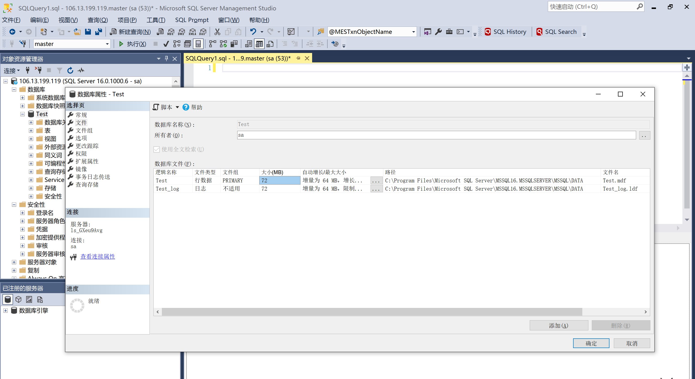
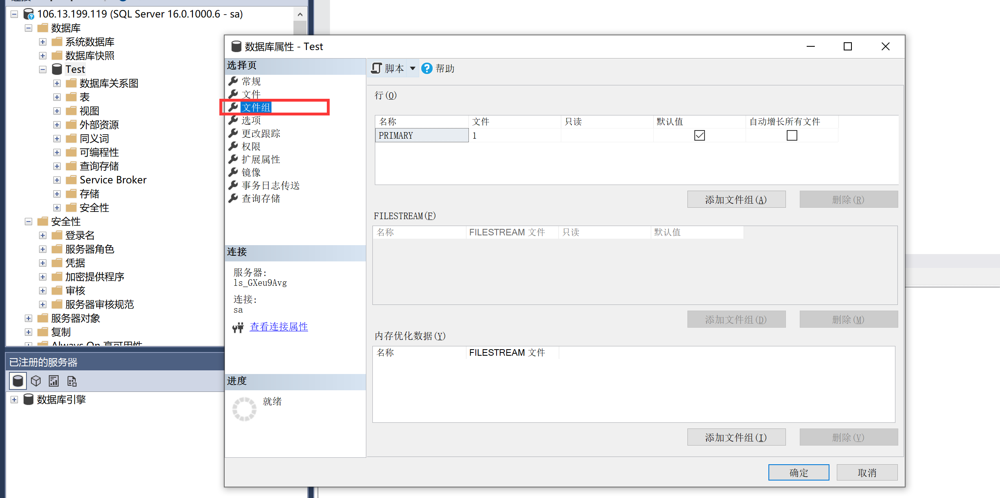
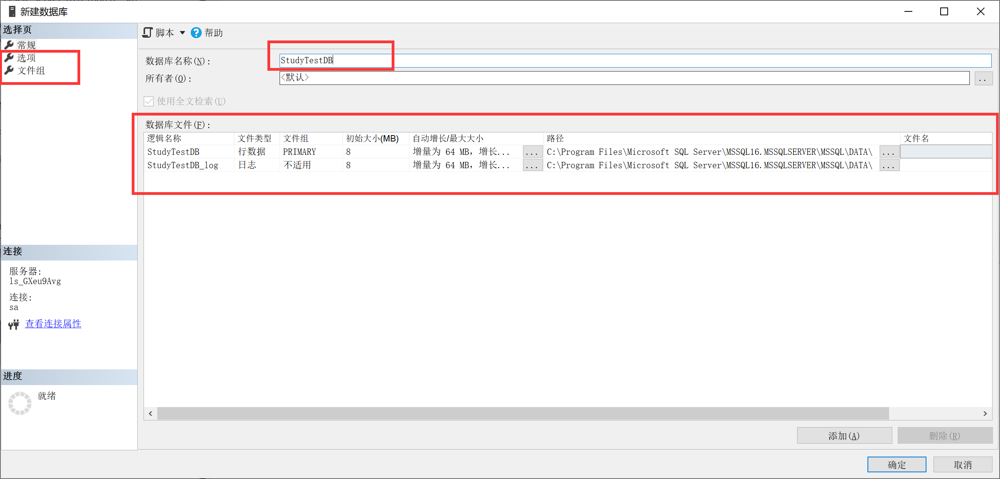

# SQL Sever 数据库操作

## 1. SQL Sever 文件

### 1.1 文件组成

#### 1.1.1 主数据文件 .mdf

* 主要数据文件的建议文件扩展名是 `.mdf`。 

* 主要数据文件包含数据库的启动信息，并指向数据库中的其他文件，存储部分或全部的数据。

    用户数据和对象可存储在此文件中，也可以存储在次要数据文件中。 

* 每个数据库有一个主要数据文件。 主要数据文件是系统默认生成的，并且在数据库中是唯一的；次要数据文件是用户根据需要添加的。

* mdf 文件并非普通文件，因此不借助相应软件是无法打开 mdf 文件的。

    打开 mdf 文件的常用虚拟光驱软件主要有：Daemon Tools 、东方光驱魔术师等。

#### 1.1.2 次要数据文件 .ndf

* 次要数据文件的建议文件扩展名是 `.ndf`。
* 次要数据文件是可选的，由用户定义并存储用户数据，用于存储主数据文件未能存储的剩余数据和 一些数据库对象。 
* 通过将每个文件放在不同的磁盘驱动器上，次要文件可用于将数据分散到多个磁盘上。
* 如果数据库超过了单个 Windows 文件的最大大小，可以使用次要数据文件，这样数据库就能继续增长。 

#### 1.1.3 事务日志文件 *. ldf

* 事务日志的建议文件扩展名是 . ldf 。 
* 事务日志文件保存用于恢复数据库的事务日志信息。
* 数据库的插入、删除、更新等操作都会记录在日志文件中（查询不会记录在日志文件中）。
* 整个的数据库有且仅有一个日志文件。 
* 每个数据库必须至少有一个日志文件。



### 1.2 文件组

#### 1.2.1 文件组概念

> 不同的文件可以存分布到不同的物理硬盘上，这样便于分散硬盘IO，提高数据的读取速度。 
>
> 数据库中数据文件的组合，称作文件组（File Group）。
>
> 数据库不能直接设置存储数据的数据文件，而是通过文件组来指定存储。



#### 1.2.2 文件组与文件关系

* SQL Server 的数据存储在文件中，文件是实际存储数据的物理实体，文件组是逻辑对象。

    SQL Server 通过文件组来管理文件。 

* 一个数据库有一个或多个文件组。

    其中主文件组（Primary File Group）是系统自动创建的。用户可以 根据需要添加其他文件组。 

    每一个文件组管理一个或多个文件，其中主文件组中包含主要数据文件（*. mdf ），主文件组中也可以 包含次要数据文件 。

*  除了主文件组之外，其他文件组只能包含辅助文件。 

#### 1.2.3 使用文件组的优势

**逻辑文件和物理文件分离**

> 数据库查找数据是先查找文件组，再去查找文件组中对应数据库文件的数据。
>
> 所以，在实际开发数据库的过程中，用户需要关注文件组，而不用关心数据库文件的物理存储。
>
> 即使 DBA 改变数据库文件的物理存储，用户也不会察觉到，也不会影响数据库去执行查询。

**分散 IO 负载**

> 对于单分区表，数据只能存到一个文件组中。如果把文件组内的数据文件分布在不同的物理硬盘上，那么 SQL Server 能同时从不同的物理硬盘上读写数据，把IO负载分散到不同的硬盘上。 
>
> 对于多分区表，每个分区使用一个文件组。把不同的数据子集存储在不同的磁盘上， SQL Server 在读写某一个分组的数据时，能够调用不同的硬盘IO。

## 2. 创建数据库

### 2.1 SSMS 工具创建

> 直接在可视化工具中右键新建数据库，在弹出框中进行数据库设置。



### 2.2 DML 语句创建

> 通过SQL 语句创建，推荐使用可视化工具。创建

````sql
-- 创建数据库
create database 新建数据库1
on primary -- 指定数据文件存储的文件组
(
	Name = '第二单元测试', -- 逻辑名称，相当于是数据库物理文件的别名，需要是唯一。
	filename = 'D:\test\新建数据库1.mdf', -- 物理名称
	size=5mb, -- 文件初始大小，初始化必须>=5 ,因为创建数据库的model 模板信息 必须是5mb以上
	filegrowth = 4mb, -- 每次增长多少，也可写成百分比，例如 20%。每次现大小上增长20%
	maxsize =200mb -- 文件的最大值，如果不写则不限制最大值。
);
````

````sql
-- 简写
create database xxx;
````

### 2.3 创建数据库次文件

> 不常用

````sql
alter database 新建数据库1
add file
(
	Name = '新建数据库1_次文件',-- 逻辑名称
	filename = 'E:\test\新建数据库1_次文件.ndf', -- 物理名称
	size=5mb, -- 文件初始大小
	filegrowth = 4mb, -- 每次增长多少
	maxsize =200mb -- 文件的最大值
)
````

## 3. 切换数据库

> 切换当前窗口操作的数据库
>
> 语法：`use 数据库名称;`

##  4. 删除数据库

> 语法：`drop database <数据库名称>;`
>
> 删除数据库时，要切换到别的数据库进行操作，不能在当前数据库删除当前数据库。

````sql
use master;-- 切换到 mater 数据库进行操作。
drop database 新建数据库1; -- 删除数据库
````

## 5. 查看数据库信息

>语法：`exec sp_helpdb '数据库名称'`

````sql
exec sp_helpdb '测试数据库'
````

## 6. 修改数据库名称

> 语法：`exec sp_renamedb '<需要修改的数据库的名称>','<新的数据库名称>' ;`

````sql
exec sp_renamedb 'Test', 'Test1'
````

## 7. 数据库备份与还原

### 7.1 数据库备份

> 语法：backup database <数据库名称> to disk = '磁盘路径';

````sql
backup database xxx to disk ='C:\test\xxx.bak';
````

### 7.2 还原

数据库不存在的情况下:

> 语法：restore database <数据库名称> from disk = '磁盘路径'

````sql
restore database xxx from disk = 'C:\test\xxx.bak'
````

数据库存在的情况下，替换还原。

> 语法：restore database <数据库名称> from disk = '磁盘路径' with replace

````sql
restore database xxx from disk = 'C:\test\xxx.bak' with replace
````

## 8. 数据库附加与分离

### 8.1 分离

> 如果想要将数据库文件进行复制，因为 SqlSever 服务是在操作数据库的，所以我们无法操作数据库文件。此时可以将数据库与SQLSever进行分离。此时，SQL Sever无法再操作该数据库，但是该数据库文件并没有被删除。

> 语法： execute sp_detach_db '<数据库名称>'

````sql
execute sp_detach_db 'xxx'
````

### 8.2 附加

> 将分离的数据库文件，重新添加到SQLSever中

> 语法： exec sp_attach_db '<数据库名称>','<数据库文件所在路径>' ;

````sql
exec sp_attach_db 'xxx','c:XXX\XXX\xx.mdf'
````

