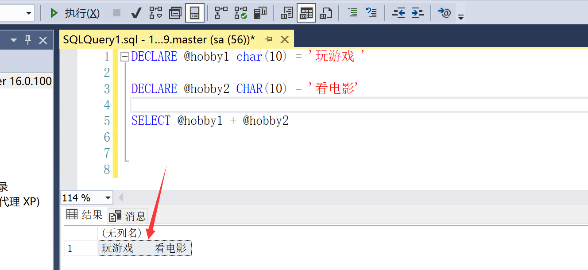
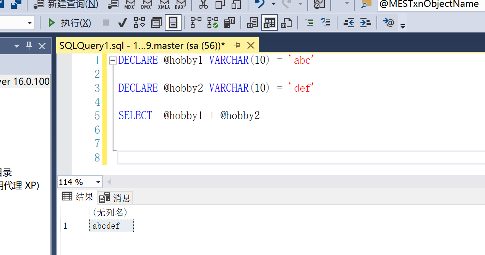

# SQL Sever 数据类型

> 数据类型官方划分：[数据类型](https://learn.microsoft.com/zh-cn/sql/t-sql/data-types/data-types-transact-sql?view=sql-server-ver16)

| 分类           | 包含数据类型                                                 |
| -------------- | ------------------------------------------------------------ |
| 精确数字       | bit、tinyint、smallint、**int**、bigint、**numeric**、**decimal**、smallmoney、money |
| 近似数         | float、real                                                  |
| 日期和时间     | **date**、time、datetime、**datetime2**、datetimeoffset、smalldatetime |
| 字符串         | **char**、**varchar**、text                                  |
| Unicode 字符串 | **nchar**、**nvarchar**、ntext                               |
| 二进制字符串   | binary、varbinary、image                                     |

## 1. 数值型

> 官方文档：[SQL Sever 数值类型](https://learn.microsoft.com/zh-cn/sql/t-sql/data-types/numeric-types?view=sql-server-ver16)

### 1.1 整型

> 1 字节 8 位，有符号数符号占一位，0 占一位。
>
> 所以：一个 n 字节的整数数据，可表示范围为 -2^(n-1) ~ 2^(n-1)-1 

| 数据类型   | 描述                                                         | 存储         |
| ---------- | ------------------------------------------------------------ | ------------ |
| bit        | 可以取值为 1、0 或 NULL 的 integer 数据类型。                |              |
| tinyint    | 允许从 0 到 255 的所有数字。（2^8 -1）                       | 1 字节 8 位  |
| smallint   | 允许从 -32,768 到 32,767 的所有数字。-(2^15)~ +(2^15)-1      | 2 字节 16 位 |
| int        | 允许从 -(2^31 ) 到 +(2^31)-1 的所有数字。正负 21亿左右       | 4 字节 32 位 |
| bigint     | 允许从 -(2^63 ) 到 +(2^63)-1 之间的所有数字。                | 8 字节 64 位 |
| smallmoney | -214,748.3648 到 214,748.3647 货币数据                       | 4 字节       |
| money      | -922,337,203,685,477.5808 到 922,337,203,685,477.5807 货币数据，仅支持两位小数，不是四位。 | 8 字节       |

### 1.2 浮点型

| 数据类型     | 描述                                                         | 存储      |
| ------------ | ------------------------------------------------------------ | --------- |
| float(n)     | 从 -1.79E + 308 到 1.79E + 308 的浮动精度数字数据。 参数 n 决定了数据的精度以及所占空间字节大小 n 取值为 1~24 时，会视为取值24，7 位小数，占用4 字节，  n 取值为 25~53 时，会视为取值53，15 位小数，占用 8 字节， n 的默认值是 53。 | 4或8字节  |
| real         | 相当于 float(24)，不常用。                                   | 4 字节    |
| numeric(p,s) | 固定精度和比例的数字。允许从 -10^38 +1 到 10^38 -1 之间的数字。 p 参数指示可以存储的最大位数（小数点左侧和右侧）。p 必须是 1 到 38 之间的值。默认是 18。 s 参数指示小数点右侧存储的最大位数。s 必须是 0 到 p 之间的值。默认是 0。 | 受P值影响 |
| decimal(p,s) | 和 numeric 相同，二者无本质区别，也无性能差异。              | 受P值影响 |

> 注：大于 2,147,483,647 的整数常量将自动转换为 decimal 数据类型，而不是 bigint 数据类型。

## 2. Binary 类型

> 二进制数据类型

| 数据类型       | 描述                                                         | 存储            |
| -------------- | ------------------------------------------------------------ | --------------- |
| binary(n)      | 长度为 n 个字节的固定长度二进制数据。 其中 n 是从 1 到 8,000 的值。 | n 字节          |
| varbinary(n)   | 可变长度二进制数据。  n 的取值范围为 1 至 8,000。  存储大小为所输入数据的实际长度 + 2 个字节。  所输入数据的长度可以是 0 字节。 | 实际输入+2 字节 |
| varbinary(max) | 可变长度的二进制数据。max 表示最大存储大小是 2^31-1 个字节。 | 实际输入+2 字节 |
| image          | **避免使用，未来会删除该类型**。                             |                 |

> 如果没有在数据定义或变量声明语句中指定 *n*，则默认长度为 1。
>
> 如果在使用 `CAST` 和 `CONVERT` 函数时未指定 *n*，则默认长度为 30。

## 3. 字符型

### 3.1 字符型数据

| 数据类型     | 描述                                                         | 存储       |
| ------------ | ------------------------------------------------------------ | ---------- |
| char(n)      | 固定大小的字符串 n 用于定义字符串大小（以字节为单位），取值1— 8,000 。  可表示字符数：n/编码规则单字符所占字节数。 | n          |
| varchar(n)   | 可变大小字符串数据 n 用于定义字符串大小（以字节为单位），取值1—8,000 。   | 实际字节+2 |
| varchar(max) | 可变长度的字符串。max 表示最大存储大小是 2^31-1 个字节       | 实际字节+2 |
| text         | **避免使用，未来会删除该类型**。                             |            |

| 数据类型      | 描述                                                         | 存储         |
| ------------- | ------------------------------------------------------------ | ------------ |
| nchar(n)      | 固定大小字符串数据。 n 用于定义字符串大小（以双字节为单位）取值1— 4,000 。 | 根据编码改变 |
| nvarchar(n)   | 可变大小字符串数据。 n 用于定义字符串大小（以双字节为单位）取值1— 4,000 。 | 实际字节+2   |
| nvarchar(max) | 可变大小字符串数据。 max 指示最大存储大小是 2^31-1 个字符 (2 GB)。 | 实际字节+2   |
| ntext         | **避免使用，未来会删除该类型**。                             |              |

> 如果没有在数据定义或变量声明语句中指定 *n*，则默认长度为 1。
>
> 如果在使用 `CAST` 和 `CONVERT` 函数时未指定 *n*，则默认长度为 30。
>
> 如果实际赋值长度超过设定长度 n，则会发生截断，导致数据保存不完整。

### 3.2 ...(n) 与 ...(max)

> 例如：`varchar(n)` 和 `varchar(max)` 是两种不同的数据类型，它们之间的区别如下：
>
> - `varchar(n)` 存储在表的行数据中，这意味着当你查询一行数据时，SQL Server 需要读取整个 `varchar(n)` 值。
>
> - `varchar(max)` 存储在一个单独的数据页而不是表的行数据中。当你查询一行数据时，SQL Server 不需要读取整个 `varchar(max)` 值，只需要读取一个指向数据页中实际值的指针。
>
> 因此，使用 `varchar(max)` 性能比 `varchar(n)` 更好，因为它减少了对行数据的读取次数，但是它需要更多的存储空间。

### 3.3 char 与 varchar

> 下列性质也适用于 nchar 与 nvarchar。

**char(n)**  

> 定长字符串，无论实际存储的数据是多大，都占用 n 字节的空间。
>
> 当实际数据不足 n 字节时，系统会用空白符号填充。

**varchar(n)** 

> 变长字符串：占用的空间大小根据实际所存字符串而定。
>
> 当实际数据不足 n 字节时，数据占用空间为：（实际数据所占字节数 + 2）。系统多分配的两个字节分别用于存储字符串的长度信息 ①实际占用空间大小，②该数据定义的可存储最大字节数。
>
> 当实际数据等于 n 字节时，数据所占空间达到最大 n + 2。

### 3.4 char 与 nchar

**1、字符编码不同**

* `char` 或 `varchar`：

    > 从 SQL Server 2019 (15.x) 起：
    >
    > 使用 UTF-8 排序规则时，这些数据类型会存储 [Unicode](https://learn.microsoft.com/zh-cn/sql/relational-databases/collations/collation-and-unicode-support?view=sql-server-ver16#Unicode_Defn) 字符数据的整个范围，**使用 UTF-8 字符编码**。 
    >
    > 若指定了非 UTF-8 排序规则，则这些数据类型仅会存储该排序规则的相应代码页支持的字符子集。

    **特点：**

    > UTF-8 编码采用的是使用可变长度编码方式，每个字符的存储长度可以是1到4个字节，根据字符的不同而变化。
    >
    > **ASCII 字符占用1字节、汉字占用2字节**
    >
    > 对于英文多的内容处理效率高。

* `nchar` 或 `nvarchar`：

    > 从 SQL Server 2012 (11.x) 起：
    >
    > 使用启用了[补充字符 (SC)](https://learn.microsoft.com/zh-cn/sql/relational-databases/collations/collation-and-unicode-support?view=sql-server-ver16#Supplementary_Characters) 的排序规则时，这些数据类型会存储 [Unicode](https://learn.microsoft.com/zh-cn/sql/relational-databases/collations/collation-and-unicode-support?view=sql-server-ver16#Unicode_Defn) 字符数据的整个范围，**使用 UTF-16 字符编码**。
    >
    > 若指定了非 SC 排序规则，则这些数据类型仅会存储 [UCS-2](https://www.wikipedia.org/wiki/Universal_Coded_Character_Set#Encoding_forms) 字符编码支持的字符数据子集。
    
    **特点：**
    
    > UTF-16 使用定长编码方式，无论是ASCII 字符还是其他字符，**每个字符固定占用2个字节**。
    >
    > 对于中文多的内容处理效率高，占用空间会比UTF-8多一些。

**2、使用语法不同**

* `char(n)` 或 `varchar(n)`：

    n 取值为1-8000，代表字节数。

* `nchar` 或 `nvarchar`：

    n 取值为1-4000，代表双字节数。

所以使用 nchar 或者 nvarchar 时，可容纳的字符数基本等同于n。使用 cahr 或者 varchar 时，可容纳的字符数 < n 。

### 3.5 使用建议

> 1、char 与 nchar 建议：
>
> * 从 SQL Server 2019 (15.x) 开始，考虑使用已启用 UTF-8 的排序规则，以支持 Unicode 并最大程度地减少字符转换问题。
> * 若使用以前版本的 SQL Server 数据库引擎，请考虑使用 Unicode **nchar** 或 **nvarchar** 数据类型，以最大程度地减少字符转换问题。
>
> 2、若使用 **char** 或 **varchar**（该建议也适用于 nchar 与 nvarchar），则建议：
>
> * 如果列数据项的大小一致，则使用 **char**。
> * 如果列数据项的大小差异相当大，则使用 **varchar**。
> * 如果列数据项大小相差很大，而且字符串长度可能超过 8,000 字节，请使用 **varchar(max)**。

## 3. 日期和时间类型

> 官方文档：[SQL Sever 日期和时间类型](https://learn.microsoft.com/zh-cn/sql/t-sql/data-types/date-and-time-types?view=sql-server-ver16)

| 数据类型       | 描述                                                         |
| -------------- | ------------------------------------------------------------ |
| date           | 可表示某天，默认格式yyyy-MM-dd。取值范围：`0001-01-01` 到 `9999-12-31`（对于 Informatica，则为 `1582-10-15` 到 `9999-12-31`） |
| datetime       | 可以24小时格式表示某个时间点。日期范围：1753年1月1日到9999年12月31日，时间范围：00:00:00 到 23:59:59.997 精度为 3.33 毫 秒。**不推荐使用**。 |
| datetime2      | 比datetime 精确度更高。日期范围：公元 1 年 1 月 1 日到公元 9999 年 12 月 31 日，时间范围：00:00:00 到 23:59:59.9999999 精度为 100 纳秒。 |
| datetimeoffset | 格式：YYYY-MM-DD hh:mm:ss[.nnnnnnn] [{+-}hh:mm]，精度和范围与 datetime2 相同，在其基础上外加了时区偏移。 |
| smalldatetime  | 取值范围：1900 年 1 月 1 日 到 2079 年 6 月 6 日，精度为 1 分钟，**不推荐使用**。 |
| time           | 仅存储时间，不存储日期。取值范围：00:00:00.0000000 到 23:59:59.9999999（对于 Informatica，为 00:00:00.000 到 23:59:59.999）精度为 100 纳秒。 |
| timestamp      | 存储唯一的数字，每当创建或修改某行时，该数字会更新。 timestamp 基于内部时钟，不对应真实时间。每个表只能有一 个 timestamp 变量。 |

## 4. 其他数据类型

| 数据类型         | 描述                                                         | 存储 |
| ---------------- | ------------------------------------------------------------ | ---- |
| uniqueidentifier | 存储全局标识符 ( GUID )，一般用于设置成主键类型，然后通过newid() 方法生成主键。 |      |
| xml              | 存储 XML 格式化数据。最多 2GB 。                             |      |
| hierarchyid      | hierarchyid 数据类型用于存储层次结构数据，例如组织结构、分类结构等。它提供了一组方法和函数，用于方便地操作层次结构，如插入、删除、移动节点等。 |      |
| rowversion       | 公开数据库中自动生成的唯一二进制数字的数据类型               |      |
| cursor           | 存储对用于数据库操作的指针的引用，rowversion 通常用作给表行加版本戳的机制。 |      |
| sql_variant      | 存储最多 8,000 字节不同数据类型的数据，除了 text、 ntext 以及 timestamp 。 |      |
| table            | 存储结果集，供稍后处理。                                     |      |
| geography        | 地理空间类型。geography 数据类型用于存储地理空间数据，如地球上的点、线、面等几何图形。它支持处理地理坐标系统的数据，例如经度和纬度。geography 数据类型提供一些方便的函数和方法，可以进行空间查询、计算距离、计算面积等操作。 |      |
| geometry         | 几何空间类型。geometry 数据类型用于存储平面坐标系的几何图形，如二维的点、线、多边形等。与 geography 类似，geometry 数据类型也提供了函数和方法来进行空间查询和计算。 |      |