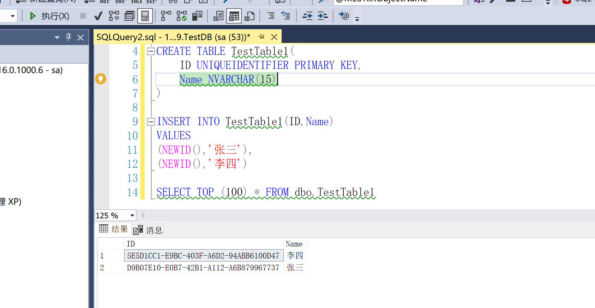

# SQL Sever 约束

## 1. 约束概念

### 1.1 基本定义

> 约束是为了维护数据表的数据唯一性、完整性而设定的一系列规则。
>
> 在我们向数据库表中插入数据时，数据库系统会根据约束对数据进行校验，防止用户在数据表中插入错误数据。

### 1.2 约束设置方式

#### 1.2.1 列级写法

> 在创建表时，直接写在列字段定义后面，可以同时定义多个约束，用空格间隔。
>
> 适合在定义表时，用来定义单字段约束。

````SQL
-- 语法
CREATE TABLE 表名(
	字段1 数据类型 约束1 约束2 约束3 ...,
    字段2 数据类型 约束1 约束2 约束3 ...,
    [...,]
    字段n 数据类型 约束1 约束2 约束3 ...
)
````

#### 1.2.2 表级写法

> 在创建表时，在列字段都定义之后，写在语句之后。
>
> 适合在定义表时，用来定义复合字段约束，以及自定义约束键名。

````sql
-- 语法
CREATE TABLE 表名(
	字段1 数据类型,
    字段2 数据类型,
    [...,]
    字段n 数据类型,
    [CONSTRAINT 自定义约束键名1] 约束1(字段1,字段2,...),
    [CONSTRAINT 自定义约束键名2] 约束2(字段1,字段2,...)
    ...
)
````

#### 1.2.3 修改约束

**为已存在表的字段添加约束**

```sql
ALTER TABLE 表名 ADD CONSTRAINT 自定义约束键名 约束名(字段1[,字段2,字段3...])
```

**为已存在表的字段修改约束**

````sql
-- 先删除原来的约束
ALTER TABLE 表名 DROP CONSTRAINT 约束键名;
-- 再添加新的约束
ALTER TABLE 表名 ADD CONSTRAINT 自定义约束键名 约束名(字段1[,字段2,字段3...])
````


## 2. 主键约束

### 2.1 特点

* 主键约束（Primary Key）用于保证数据的完整性，唯一性。
* 主键字段在表中是唯一的、且字段不能为 null。
* 一个表只能设置一个主键，但是主键可以由 1 个或者多个字段组成。
* 由多个字段组成的主键称之为复合主键。
* 一般将能准确唯一地描述出表中每条数据的最少几个字段设置为主键。常用的主键字段为 ID。
* 自定义主键名一般格式为 `PK__表名__自定义名`

### 2.2 设置主键

````sql
-- 1. 写法一：列级约束写法
CREATE TABLE 表名
(
	Id INT PRIMARY KEY,
    ...
)
-- 2. 写法二：表级约束写法
CREATE TABLE 表名
(
	Id INT,
    ...,
    CONSTRAINT 自定义约束键名 PRIMARY KEY(Id)
)
-- 2. 写法三：为已存在表添加主键
ALTER TABLE 表名 ADD CONSTRAINT 自定义约束键名 PRIMARY KEY(字段)
````

### 2.3 主键生成策略

#### 2.3.1 identity关键字

> identity 用于定义数字类型的自增主键。可以为数据表简单的解决数据“原子性”问题，新增数据时不用我们手动插入主键。
>
> 语法：字段 数据类型 identity(m,n)  -- 从 m 开始自增，每次增加 n。
>
> 缺点：
>
> * 如果删除数据后，identity 自增种子会断片，不连续 
> * 不能应对分布式系统，可能会造成数据不一致性。

````sql
CREATE TABLE 表名
(
	Id INT identity,-- 默认是从1开始自增，每次增加1
)
````

#### 2.3.2 uniqueidentifier

> uniqueidentifier 类型可以规定一种国际通用标识符类型主键，配合 newid() 函数使用可以生成一种固定格式的字符串主键数据
>
> 缺点：
>
> * 也是只适用于单机以及并发量小的系统。
> * 对于高并发以及分布式系统不适用。

````sql
CREATE TABLE TestTable1(
	ID UNIQUEIDENTIFIER PRIMARY KEY,
	Name NVARCHAR(15)
)

INSERT INTO TestTable1(ID,Name) 
VALUES
(NEWID(),'张三'),
(NEWID(),'李四')
````



## 3. 唯一约束

> 唯一约束 (Unique)，表示该字段数据在表中是唯一的，和主键功能类似。
>
> 区别：①唯一约束可以有一条数据为null。②使用没有主键约束的那种唯一标识一条数据的语义。
>
> 自定义唯一约束键名一般格式为 `UQ__表名__自定义名`

```sql
-- 1. 写法一：列级约束写法
CREATE TABLE 表名
(
	Id INT,
    phone char(11) UNIQUE,
    ...
)
-- 2. 写法二：表级约束写法
CREATE TABLE 表名
(
	Id INT,
    phone char(11),
    ...,
    CONSTRAINT 自定义约束键名 UNIQUE(Id)
)
-- 2. 写法三：为已存在表添加主键
ALTER TABLE 表名 ADD CONSTRAINT 自定义约束键名 PRIMARY KEY(字段)
```


## 4. 外键约束

### 4.1 外键定义

> 外键（foreign key）约束，表示该字段的数据必须在另外某表的某**主键列**(字段)数据中存在。
>
> 如果一个表的主键被另外一个表字段设置了外键引用，那么在删除该表时，得先删除外键引用才能删除该表。
>
> 自定义外键约束键名一般格式为 `FK__表名__自定义名`
>
> 实际工作中外键不设置，一般在表中使用逻辑外键(即定义出外键字段，但并不设置外键约束)

````sql
-- 写法1
CREATE TABLE 表名
(
	Id INT,
    ForeignID INT FOREIGN KEY REFERENCES 外表名(外表字段),
    ...
)

-- 写法2
CREATE TABLE 表名
(
	Id INT,
    ForeignID INT,
    CONSTRAINT 自定义约束键名 FOREIGN KEY(ForeignID) REFERENCES 外表名(外表字段)
)

-- 写法3
ALTER TABLE 表名 ADD CONSTRAINT 自定义约束键名 FOREIGN KEY(ForeignID) REFERENCES 外表名(外表字段)
````

### 4.2 联级删除与联级更新

> 在使用外键时，如果表中字段被另一个表字段设置了外键引用，那么该表的数据就不能被轻易删除和更新，因为数据被其他表所使用，得先删除或者更新引用的数据后才能删除或跟新该表数据。
>
> 此时，为了方便删除或者更新两个相关联的数据，在设置外键时可以设置**联级删除**和**联级更新**，这样我们在删除或者更新表中数据时，会自动将引用了该数据的子表数据也一并删除或者更新。
>
> 联级删除语法：on delete cascade
>
> 联级更新语法：on delete cascade，

````sql
create table UserInfo
(
	Id int primary key identity,
	UserName varchar(50) not null,
	RoleId uniqueidentifier not null foreign key references RoleInfo(Id) on delete cascade on update cascade
)
````


## 5. 非空约束

> 非空约束，用 NOT NULL 或者 NULL 来规定字段是否可以存入 null 值。
>
> 出于对数据库性能优化的考虑，一般字段都设置成 NOT NULL。

```sql
CREATE TABLE 表名
(
	Id INT,
    Name NVARCHAR(15) NOT NULL, 
    Hobby NVARCHAR(15) NULL
)
```


## 6. 默认值约束

> 默认值约束（Default），用于给字段设置默认值。

````sql
-- 方式一
CREATE TABLE 表名
(
	Id INT,
    Name NVARCHAR(15) NOT NULL, 
    Hobby NVARCHAR(15) NOT NULL DEFAULT N'无'
)

-- 方式二
ALTER TABLE 表明 ADD CONSTRAINT 自定义约束键名 DEFAULT(默认值) FOR 字段名
````


## 7. 检查约束

> 检查约束（Check），通过逻辑表达式对数据进行校验。
>
> Check 中可以调用 SQL Sever 中的函数，也可以使用 in 、and、or 这些逻辑操作符以及通配符。

| 运算符                    | 含义                                             |
| ------------------------- | ------------------------------------------------ |
| = 、<>、!、>、<、>=、<=、 | 等于、不等于、非、大于、小于、大于等于、小于等于 |

| 通配符 | 含义                         | 实例                        |
| ------ | ---------------------------- | --------------------------- |
| '_'    | 一个字符                     | LIKE '张_'                  |
| %      | 任意长度字符串               | LIKE '张%'                  |
| []     | 括号内指定范围的一个字符     | LIKE '[1-10]'、LIKE '[a-z]' |
| [^]    | 不在括号内指定范围的一个字符 | `LIKE '[^1-10]'`            |

````sql
CREATE TABLE 表名
(
	Id int PRIMARY KEY identity,
	Name varchar(20),
	Sex varchar(10) CHECK(Sex in('男','女')), -- 性别：检查性别只能输入 男 或者 女
	Age tinyint CHECK(Age>=18), -- 年龄：检查年龄是否大于等于18
	Pwd varchar(50) CHECK(len(Pwd)>=4 and len(Pwd)<=16), -- 密码：密码的实际长度必须是4-16位
)
````