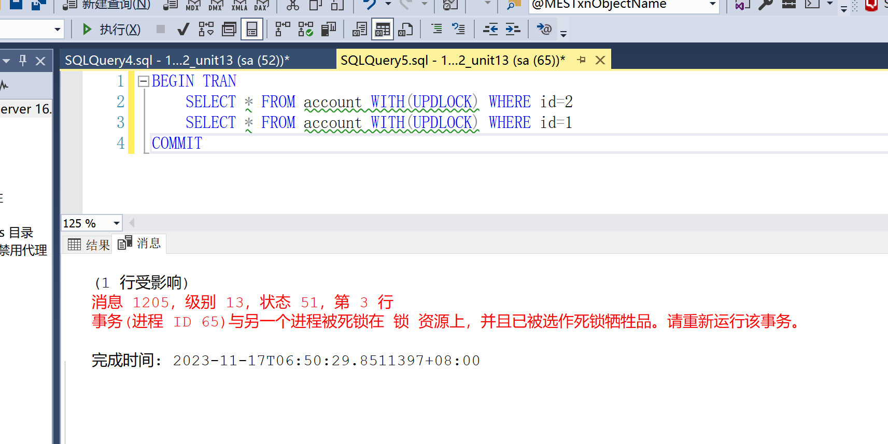

# SQL Sever 事务与锁

官方文档：[事务、锁和行版本控制指南](https://learn.microsoft.com/zh-cn/sql/relational-databases/sql-server-transaction-locking-and-row-versioning-guide?view=sql-server-ver15)

> 笔记演示数据源

````sql
-- 账户表
CREATE TABLE account (
	id INT PRIMARY KEY identity,
	NAME VARCHAR(10),
	balance decimal(10,2)
);
-- 添加测试数据
INSERT INTO account (NAME, balance) VALUES ('张三', 1000), ('李四', 1000);

-- 数据重置
TRUNCATE TABLE dbo.account
INSERT INTO account (NAME, balance) VALUES ('张三', 1000),('李四',1000)
SELECT TOP (100) * FROM dbo.account
````

## 1. 事务定义

> 事务就是一组数据库操作的集合，这些操作要么全部成功执行，要么全部失败执行回滚。
>
> SQL Sever 中分为显示事务和隐式事务
>
> * 显示事务：如下方代码所示，使用 BEGIN TRANSACTION 或者 BEGIN TRAN 方式显示定义并提交的事务
> * 隐式事务：即不显示的通过 BEGIN 开启事务。执行完部分代码后 commit 后，自动开启新事务。当我们在一个窗口中每使用CREATE、DELETE、ALTER TABLE 等等语句时，会自动开启一个事务。
>
> 结束事务
>
> * commit 成功提交修改数据。
> * rollback 失败回滚所有改动的数据。

````sql
BEGIN TRANSACTION -- 开启事务,也可以简写成 BEGIN TRAN
BEGIN TRY
	.....	-- 一系列操作
	commit; -- 提交
END TRY
BEGIN CATCH
	ROLLBACK;	-- 回滚
END CATCH
````

## 2. 事务四大特性

>事务遵循ACID原则，即原子性、一致性、隔离性和持久性。

### 2.1 原子性

> 原子性（Atomicity）表示事务操作被看做是一个不可分割的执行整体，事务包含数据操作要么全部执行成功，要么全部失败；

### 2.2 一致性

> 一致性（Consistency）表示事务执行前后，该事务所涉及的数据变化保持一致。
>
> 例如：A向B转账，A金额减10，B金额加10，事务前后总数都是一致的。

### 2.3 隔离性

> 隔离性（Isolation）表示事务与事务之间相互独立，互不干扰。

### 2.4 持久性

> 持久性（Durability）一旦事务提交，其对数据的操作将永久保存在数据库中。

## 3. 事务原理

> 事务操作原理：SQL事务的原理在于数据库管理系统通过事务日志、并发控制、回滚和恢复机制、提交机制以及数据库日志等功能的实现，来保证事务的ACID特性

* **事务日志**：

    DBMS通过记录事务日志来记录事务的开始和结束时间、对数据的修改等信息，以便在发生故障时进行回滚和恢复。

    事务开启之后, 所有的操作都会临时保存到事务日志中, 事务日志只有在得到 commit 命令才会同步到数据表中，其他任何情况都会清空事务日志(rollback，断开连接)

* **并发控制**：

    DBMS 通过 **锁机制** 和 **事务隔离级别机制** 来保证多个事务的隔离性。

事务的执行步骤：

1) 客户端连接数据库服务器，创建连接时创建此用户临时日志文件
2) 开启事务以后，所有的操作都会先写入到临时日志文件中 
3) 所有的查询操作从表中查询，但会经过日志文件加工后才返回 
4) 如果事务提交则将日志文件中的数据写到表中，否则清空日志文件。

## 4. 事务并发问题

> 当并发访问时，可能会产生如下问题：

| 问题       | 描述                                                         |
| ---------- | ------------------------------------------------------------ |
| 脏读       | 事务读取到了另一个事务操作中尚未提交的数据                   |
| 不可重复读 | 事务中两次读取的数据内容不一致。（一个事务两次读取操作间隔中间，另一个事务进行了 update 操作。） |
| 幻读       | 事务中两次读取的数据的数量不一致。（一个事务两次读取操作间隔中间，另一个事务进行了 增、删 操作。） |

> 幻读在官方文档中称为：虚拟读取

### 4.1 脏读

> 执行下方窗口 1 代码后，10 秒内立马执行窗口 2 代码。窗口 2 可以查询到窗口 1 执行完的第一条update数据。
>
> 读取到了事务未提交的数据，产生脏读。

````sql
-- 窗口1
SET TRAN ISOLATION LEVEL READ UNCOMMITTED -- 手动设置事务隔离级别为最低级别，暴露要测试的并发问题
BEGIN TRAN
	
	update account set balance = balance - 500 where name='张三';

	WAITFOR DELAY '00:00:10'; -- 暂停10秒，方便演示查看

	update account set balance = balance + 500 where name='李四';
	
COMMIT;
````

```` SQL
-- 窗口2
SET TRAN ISOLATION LEVEL READ UNCOMMITTED -- 手动设置事务隔离级别为最低级别，暴露要测试的并发问题
BEGIN TRAN

	SELECT * FROM dbo.account

COMMIT;
````

### 4.2 不可重复读

> 执行窗口 1 代码后，10秒内立马执行窗口 2 代码，再返回窗口 1查看两次执行结果，会发现事务中两次 SELECT 数据不一致。
>
> 一个事务中两次读取的数据内容不一致，产生不可重复读问题

````sql
-- 窗口1
SET TRAN ISOLATION LEVEL READ UNCOMMITTED -- 手动设置事务隔离级别为最低级别，暴露要测试的并发问题
BEGIN TRAN
	SELECT * FROM dbo.account

	WAITFOR DELAY '00:00:10'; -- 暂停10秒，方便演示查看

	SELECT * FROM dbo.account
COMMIT;
````

````sql
-- 窗口2
SET TRAN ISOLATION LEVEL READ UNCOMMITTED -- 手动设置事务隔离级别为最低级别，暴露要测试的并发问题
BEGIN TRAN
	
	update account set balance = balance - 500 where name='张三';

	update account set balance = balance + 500 where name='李四';
	
COMMIT;
````

### 4.3 幻读 (虚拟读取)

>执行窗口1代码后，10秒内立马执行窗口2代码，再返回窗口1，查看窗口1两次执行结果，会发现事务中两次统计的数量不一致。
>
>一个事务中两次读取的数据的数量不一致，产生幻读问题。

````sql
-- 窗口1
SET TRAN ISOLATION LEVEL READ UNCOMMITTED -- 手动设置事务隔离级别为最低级别，暴露要测试的并发问题
BEGIN TRAN
	SELECT COUNT(*) FROM dbo.account

	WAITFOR DELAY '00:00:10'; -- 暂停10秒，方便演示查看

	SELECT COUNT(*) FROM dbo.account
COMMIT;
````

````sql
-- 窗口2
SET TRAN ISOLATION LEVEL READ UNCOMMITTED -- 手动设置事务隔离级别为最低级别，暴露要测试的并发问题
BEGIN TRAN
	
	INSERT INTO account (NAME, balance) VALUES ('王五', 1000)
	
COMMIT;
````

### 4.4 更新丢失

> 当两个或多个事务选择同一行，然后基于最初选定的值更新该行时，会发生丢失更新问题。 每个事务都不知道其他事务的存在, 最后的更新将覆盖由其他事务所做的更新，这将导致数据丢失。
>
> 例如：
>
> * 有个事务处理逻辑：在原来数据的基础上+1
> * 修改数据的先后顺序应该是 ①找到该条数据，②在原来的数据基础上+1
> * 当A,B两个并发事务，步骤①几乎是同时进行的，A和B获取到了一模一样的数据，然而步骤②有先后顺序，A先执行，B后执行。
> * 理论上应该是B在A已经+1的基础上再加1
> * 由于并发问题，二者很可能都是基于步骤①获取到的数据+1，这样导致B事务的操作就覆盖了A事务的操作。
>
> SQL Sever 中 update 语句自带更新锁，所以无法演示效果。

## 5. 事务的隔离级别

### 5.1 定义

> 设置事务的隔离级别，可避免出现并发引起的 脏读、幻读、不可重复读 问题。
>
> 一般来说事务隔离级别越高、性能越差、安全性越高。
>
> 定义事务隔离级别相关语法如下：

````SQL
DBCC USEROPTIONS -- 查看当前的事务隔离级别
set transaction isolation level <事务隔离级别>;
````

### 5.2 隔离级别类型

> 采用锁方式实现的事务控制

| 等级 | 名称               | 事务隔离级别       | 实现方式   | 脏读   | 重复读 | 幻读   | 读写冲突 | 额外的tempdb开销 |
| ---- | ------------------ | ------------------ | ---------- | ------ | ------ | ------ | -------- | ---------------- |
| 1    | 读未提交           | read uncommitted   | 锁         | 是     | 是     | 是     | 否       | 否               |
| 2    | 读已提交(默认类型) | read committed     | 锁         | **否** | 是     | 是     | 是       | 否               |
|      | 读已提交(RCSI类型) | 开启数据库特定设置 | 行版本控制 | **否** | 是     | 是     | **否**   | 是               |
| 3    | 可重复读           | repeatable read    | 锁         | **否** | **否** | 是     | 是       | 否               |
| 4    | 串行化             | serializable       | 锁         | **否** | **否** | **否** | 是       | 否               |
| 5    | 快照               | Snapshot           | 行版本控制 | **否** | **否** | **否** | **否**   | 是               |

注：

> 当开启数据库 READ_COMMITTED_SNAPSHOT 的设置(设置为ON) 时，读已提交（read committed）底层会和快照一样，采用使用行版本控制来实现，解决了读写冲突问题提高了性能。

````SQL
ALTER DATABASE 数据库 SET READ_COMMITTED_SNAPSHOT ON
````

### 5.3 行版本控制

> 当启用基于行版本控制的隔离级别时，SQL Server 数据库引擎将维护修改的每一行的版本。 
>
> 应用程序可以指定事务使用行版本查看事务或查询开始时存在的数据，而不是使用锁保护所有读取。
>
> 通过使用行版本控制，读取操作阻止其他事务的可能性将大大降低。
>
> 注：一些更新锁定问题，无法使用行版本控制来规避。

### 5.4 快照隔离级别

#### 5.4.1 快照简介

> 一般事务隔离原理是使用锁，所以事务级别越高事务时效率越低，还容易发生锁表的情况。
>
> 为此，后面推出了 快照Snapshot 隔离级别，快照隔离级别在功能上和串行化相同，都能解决脏读、不可重复读和幻读等情况。
>
> 但是快照的隔离原理是行版本控制，在使用时是通过版本记录来规避事务中不可重复读和幻读问题。

#### 5.4.2 快照原理演示

> 使用快照隔离级别，首先要开启数据库的快照功能。

````sql
-- 开启数据库快照功能
ALTER DATABASE 数据库 SET ALLOW_SNAPSHOT_ISOLATION ON;
````

> 按顺序执行下方代码：
>
> * 执行窗口 1 代码后，10秒内立马执行窗口2代码。
> * 执行窗口 2 代码时会发现能立即执行，并不会发生等待现象。
> * 返回窗口 1 查看两条 SELECT 语句，会发现两次执行结果是相同的，且查询结果是在窗口2 执行之前的数据。
> * 注意：如果两个事务都对表进行了更新，那么后执行的事务会因为表被锁定无法执行，会有更新冲突。

````sql
-- 窗口1
SET TRAN ISOLATION LEVEL SNAPSHOT -- 设置快照隔离级别
BEGIN TRAN
	-- 事务开启时，系统就会在 tempdb 创建该事务中涉及的所有表，创建一个此时此刻数据状态的一个快照（形成一个版本数据）
	SELECT * FROM dbo.account 
	
	WAITFOR DELAY '00:00:10'; -- 暂停10秒，方便演示查看

	SELECT * FROM dbo.account -- 再次查询该表时，去 tempdb 查询事务最开始保存的快照，这样保证了前后数据的一致性。
COMMIT;
````

````sql
-- 窗口2
SET TRAN ISOLATION LEVEL SNAPSHOT -- 设置快照隔离级别
BEGIN TRAN
	
	update account set balance = balance - 500 where name='张三';

	update account set balance = balance + 500 where name='李四';
	
COMMIT;
````

### 5.5 事务语句限制

> 显式事务中不能使用如下语句

```sql
-- 增、删、改数据库
CREATE DATABASE
DROP DATABASE
ALTER DATABASE
-- 增、删、改数据库文件
CREATE FULLTEXT CATALOG 
ALTER FULLTEXT CATALOG
DROP FULLTEXT CATALOG
DROP FULLTEXT INDEX
ALTER FULLTEXT INDEX …
CREATE FULLTEXT INDEX …
-- 备份、重置语句
BACKUP
RESTORE
RECONFIGURE
-- 全文系统存储过程
sp_dboption -- 用于设置数据库选项
-- 不允许显式事务或隐式事务内部修改 `master` 数据库的任何系统过程。
```

## 6. 锁

### 6.1 锁的定义

>锁是一种在多用户访问同一数据库资源时，对资源访问的先后顺序进行权限管理的机制。

### 6.2 锁的种类

#### 6.2.1 锁的分类

* 根据锁的作用方式和目的，可以分为以下几类：

| 锁类型                            | 作用                                                         |
| --------------------------------- | ------------------------------------------------------------ |
| 共享锁(Shared  Lock)              | 简称 S 锁，用于读操作。在一个事务处理任务时，允许其他事务同时进行 **读** 操作。 |
| 排他锁(Exclusive  Lock)           | 简称 X 锁，也叫**独占锁**，用于写操作。在一个事务处理任务时，**不允许**其他事务同时进行 **读、写** 操作。 |
| 更新锁(Update  Lock)              | 简称 U 锁，用于更新操作，是共享锁和排它锁的结合体。          |
| 意向锁(Intent Lock)               | 表明事务打算获取其他锁，用于协调高级别锁(如表锁)与低级别锁(如行锁)。 |
| 关键字锁(Key-Range Lock)          | 保护索引序列，防止其他事务在索引键之间插入数据。             |
| 架构锁(Schema Lock)               | 锁定表的结构，用于修改表结构、添加或删除列、添加或删除约束等。 |
| 扩展意向锁(Extended Intent Locks) | 结构上的锁，它指定SQL Server在给定页或表上意图独占某些资源。 |
| 插入锁(Insert Lock)               | 防止在插入数据的事务中引起的阻塞。                           |
| Bulk Update Locks(BULK)           | 在大批量插入数据操作时，提高执行效率，阻止其他读写操作。     |

* 根据锁的作用对象，可以分为以下几类锁粒度：

| 锁类型             | 作用                       |
| ------------------ | -------------------------- |
| 行锁(Row Lock)     | 锁定数据表中的单行数据。   |
| 页面锁(Page Lock)  | 锁定包含多行数据的数据页   |
| 表锁(Table Lock)   | 锁定整个数据表，包括所有行 |
| 索引锁(Index Lock) | 锁定索引条目               |

* 根据并发控制策略，可分为以下两类

    1. 悲观锁

        总是假设最坏的情况，每次去拿数据的时候都认为别人会修改。

        所以每次在拿数据的时候都会上锁，这样别人想拿这个数据就会阻塞，直到它拿到锁。

        即：共享资源每次只给一个线程使用，其它线程阻塞，用完后 再把资源转让给其它线程。

    2. 乐观锁

        总是假设最好的情况，每次去拿数据的时候都认为别人不会修改，所以不会上锁。

        但是在更新的时候会 判断一下在此期间别人有没有去更新这个数据。

        如果其他用户更新了数据，将产生一个错误。 一般情况下，收到错误信息的用户将回滚事务并重新开始。

#### 6.2.2 行锁

> 关键字：**rowlock**
>
> 分类：属于乐观锁

````sql
select * from 表 WITH (ROWLOCK) where 筛选条件
````

#### 6.2.3 表锁

>  关键字： **tableLockX**
>
> 分类：属于悲观锁

````sql
select * from 表 WITH(TABLOCKX) where 筛选条件
````

#### 6.2.4 共享锁（S）

> 共享锁 (Shard Lock) 简称 S 锁。
>
> 共享锁是用于读取数据操作，允许多个事务读取相同的数据，但不允许其他事务修改当前相同数据。即允许查看，不允许修改。
>
> 关键字：**holdlock**
>
> 分类：属于行锁(条件要一致)、属于乐观锁

````sql
-- 窗口1
BEGIN TRAN
	SELECT * FROM account WITH(HOLDLOCK) WHERE id=1
	WAITFOR DELAY '00:00:10';
COMMIT;
````

````sql
-- 窗口2
BEGIN TRAN
	UPDATE account SET balance+=1 WHERE id=1 -- SELECT 语句，或更改了 WHERE 条件的Update语句，则不会被锁。
COMMIT;
````

#### 6.2.5 排它锁（X）

> 排它锁（Exclusive  Lock），又称为**独占锁**，简称 X 锁。
>
> 排它锁是用于写操作，当一个事务在处理数据时，不允许其他事务进行读写。即不允许其他事务进行操作。
>
> 关键字：**updlock**
>
> 分类：属于行锁(条件要一致)、属于乐观锁

````SQL
-- 窗口1
BEGIN TRAN
	SELECT * FROM account WITH(UPDLOCK) WHERE id=1
	WAITFOR DELAY '00:00:05';
COMMIT;
````

````sql
-- 窗口2
BEGIN TRAN
	SELECT * FROM account WITH(UPDLOCK) WHERE id=1 -- 得等窗口一执行完毕才能读取结果
COMMIT;
````

#### 6.2.5 更新锁（U）

> 更新锁（Update  Lock），简称 U 锁。
>
> 系统在执行update 语句时，会自带更新锁，在更新数据时，会 将更新锁自动转换为排它锁。

### 6.3 死锁

#### 6.3.1 定义

> 在多个任务中，任务与任务之间互相锁定了对方需要使用的资源，都在等着对方释放资源才能继续执行的情况。

#### 6.3.2 死锁演示

例：

* 先执行窗口 1 代码，然后在 10 秒内，立即执行窗口 2 代码。
* 执行窗口 1 代码时，窗口1中的事务1 先获取到了 id=1 的独占锁，然后阻塞10秒。
* 执行窗口 2 代码时，窗口2中的事务2 先获取到了 id=2 的独占锁。
* 紧接着，事务2继续执行，需要等待事务 1 执行完毕后，释放 id=1 的锁。。。
* 5秒后，事务1继续执行，此时事务1 需要等待事务2 执行完毕后，释放 id=2 的锁。。。
* 这样，事务1 和 事务2 都在等待对方释放锁，才能让自己执行完毕，产生死锁问题。

注：SQL Sever 数据库引擎，检测到这种情况时，会根据事务执行的先后顺序，关闭后执行的事务进程，来解决死锁问题。此时后执行的事务会变成牺牲品，需要重新运行。

````sql
-- 窗口 1
BEGIN TRAN
	SELECT * FROM account WITH(UPDLOCK) WHERE id=1
	WAITFOR DELAY '00:00:05';
	SELECT * FROM account WITH(UPDLOCK) WHERE id=2
COMMIT
````

````sql
-- 窗口 2
BEGIN TRAN
	SELECT * FROM account WITH(UPDLOCK) WHERE id=2
	SELECT * FROM account WITH(UPDLOCK) WHERE id=1
COMMIT
````



#### 6.3.3 如何减少死锁

> * 在所有事务中以相同的次序使用资源
>
> * 使事务尽可能简短并且在一个批处理中，不要写过长的事务。
>
> * 避免在事务内和用户进行交互，减少资源的锁定时间 
>
> * 为死锁超时参数设置一个合理范围

### 6.4 不加锁

> 通过 WITH(NOLOCK) 语句，可以手动声明查询不加锁，可以跳过事务隔离机制的限制，允许出现脏读。
>
> 优点是可以在并发低、逻辑简单的系统中，提高执行速度。

````sql
SELECT * FROM 表 WITH(NOLOCK) WHERE 条件
````


