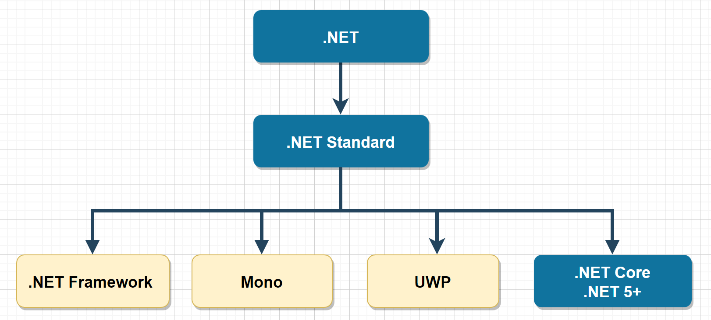

# C# 简介与基本语法

## 1. C# 语言

* C# 是微软公司发布的一种由 C 衍生出来的面向对象编程语言，是一种运行于`.NET`平台的高级编程语言。

* C# 是面向对象的、面向组件的编程语言。

## 2. .NET 简介

### 2.1 什么是 .NET ？

> .NET 官方介绍：[什么是 .NET?](https://dotnet.microsoft.com/zh-cn/learn/dotnet/what-is-dotnet)

* `.NET` 是由微软创建的一个跨平台的开源开发平台。
* 开发人员可以使用C#、F# 或 Visual Basic 等高级编程语言，在`.NET`平台编写各种类型的应用程序（主要以C#为主）。
* .NET 平台可实现应用：
    * **数据库操作**：`ADO`
    * **web 应用**：`ASP.NET`，支持HTTP等网络请求处理。
    * **桌面端应用**：`winform`、`WPF`、`.NET MAUI`
    * **游戏开发**：` Unity3D`、`Mono`
    * **iso、Android等移动应用**：`.NET MAUI`、`Xamarin`
    * **微服务应用**：可在 Docker 容器上运行的应用
    * **AI机器学习**：`ML.NET`
    * **物联网、嵌入式**：`.NET IoT`、`.NET nanoFramework`、`Meadow`

### 2.2 .NET 环境

#### 2.2.1 .NET 平台的实现

* **.NET Framework**
    * 主要用于桌面开发。是自 2002 年起就已存在的一个比较老的 .NET 实现，包含了一些Windows 桌面开发的特定 API。
    * .NET Framework 4.5 版以及更高版本实现 .NET Standard，因此面向 .NET Standard 的代码都可在这些版本的 .NET Framework 上运行。
* **Mono**
    * 主要在需要小型运行时使用的 .NET 实现，它是在 Android、macOS、iOS、tvOS 和 watchOS 上驱动 Xamarin 应用程序的运行时，且主要针对小内存占用。
    * 它支持所有当前已发布的 .NET Standard 版本。
* **UWP**
    * UWP 是用于为物联网 (IoT) 生成新式触控 Windows 应用程序和软件的 .NET 实现。
    * 它旨在统一可能想要以其为目标的不同类型的设备，包括电脑、平板电脑、电话，甚至 Xbox。
* **.NET Core 以及 .NET 5+** (主要实现)
    * 专用于处理大规模的服务器和云工作负载，支持跨平台,是目前.NET 平台的主要实现。
    * 它也可实现 .NET Standard，因此面向 .NET Standard 的代码都可在 .NET 5+ 上运行，例如：ASP.NET、Windows 窗体、WPF 等。
    * 该实现早期版本一直以 .NET Core 命名，例如：.NET Core 2.0、.NET Core 2.1 ......，自 .NET Core 3.1 之后的版本，微软开始直接采用 .NET 命名，并且直接跳到了 .NET 5。后续每年发布一个版本，奇数年发布短期支持版本，偶数年发布长期支持版本。

#### 2.2.2 .NET Standard

* .NET Standard 是针对多个 .NET 实现推出的一套正式的 .NET API 规范，推出 .NET Standard 的背后动机是要提高 .NET 生态系统中的一致性。
* .NET 5 及更高版本采用不同的方法来建立一致性，这种方法在大多数情况下都不需要 .NET Standard，.NET 5、.NET 6 以及所有将来的版本将继续支持 .NET Standard 2.1 及更早版本。
* 如果要在 .NET Framework 和其他任何 .NET 实现（例如 .NET Core）之间共享代码，则库必须面向 .NET Standard 2.0。

#### 2.2.3 .NET 术语

> 官方文档：https://learn.microsoft.com/zh-cn/dotnet/standard/glossary

| 常用术语          | 含义                                                         |
| ----------------- | ------------------------------------------------------------ |
| CLR               | Common Language Runtime 共语言运行时环境。例如 .NET Framework 或 .NET。 |
| CLS               | Common Language Specification 通用语言规范。                 |
| CTS               | Common Type System 通用类型系统。                            |
| JIT               | Just-In-Time Complier 及时编译系统，生产机器码。编译时会有代码优化，对热点代码(Hot Pot)会缓存。 |
| CLI               | 公共语言基础结构。是创建执行和开发环境的基础，语言和库可以在其中无缝地协同工作。 |
| 程序集 (assembly) | .dll 或 .exe 文件，其中包含一组可由应用程序或其他程序集调用的 API |
| 基类库（BCL）     | 一组构成 `System.*`（在一定的程度上构成 `Microsoft.*`）命名空间的库 |

## 3. 发展简史

* 2002 年：发布了第一版 .NET，实现的平台是 .NET Framework，只能在Windows系统运行。

* 2002—2014年：.NET Framework 平台新增了各种支持，以及框架。例如：ASP.NET、WPF、WPC、WCF、WF ... 等等。

    期间，一些开发者觉得 C# 语言比较优雅，但是 .NET Framework 不开源、不支持跨平台，不能在Linux上使用这点让他们很可惜。

    于是一些社区大牛就联合开发了 `Mono` 运行时，相当于.NET 的一个开源且跨平台版本 。他们还开发了比较出名的 **`Xamarin`** 框架，可以让 C# 代码还可以运行在 Android、ios 等平台。 

* 2009 年：Web 开发大行其道，Java、PHP 崛起，微软市场份额迅速被瓜分。

* 2014 年：萨提亚·纳德拉担任微软第三任 CEO。微软改变策略，开始走开源、跨平台策略。微软推出了开源且支持跨平台的 .NET Core 运行时。此后，微软开始将原来.NET Framework 平台的功能，开始逐步在  .NET Core 中实现，期间 .NET Framework 也仍在更新。

* 2016 年：.NET Core 正式发布，后续每年都持续更新各种功能。

* 2019 年：.NET Core 3.0 发布，.NET Core 已经稳定下来，此时.NET Framework 升级到了 4.8，也成为了 .NET Framework 的最后一个版本。

* 2020 年：微软取消了 .NET Framework 后续大版本的更新，主要发展 .NET Core，并将 .NET Core 平台更名为 .NET。为了避免与 .NET Framework 4.x 版本号冲突，.NET 后续直接从版本号 5开始，此前 .NET Core 更新到 3.1 版本。同年11 月，.NET 5 发布。

* 2021年：，微软正式发布了 .NET 6 及其一系列内容，推出了 C# 10、F# 6 和 PowerShell 7.2，.NET 6 还原生支持了苹果 M1 芯片，将得到三年支持。

* 2022 年 ：`.NET 7` 发布。

****

End

