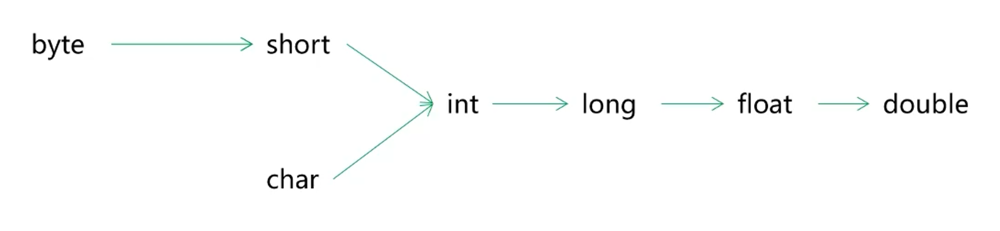
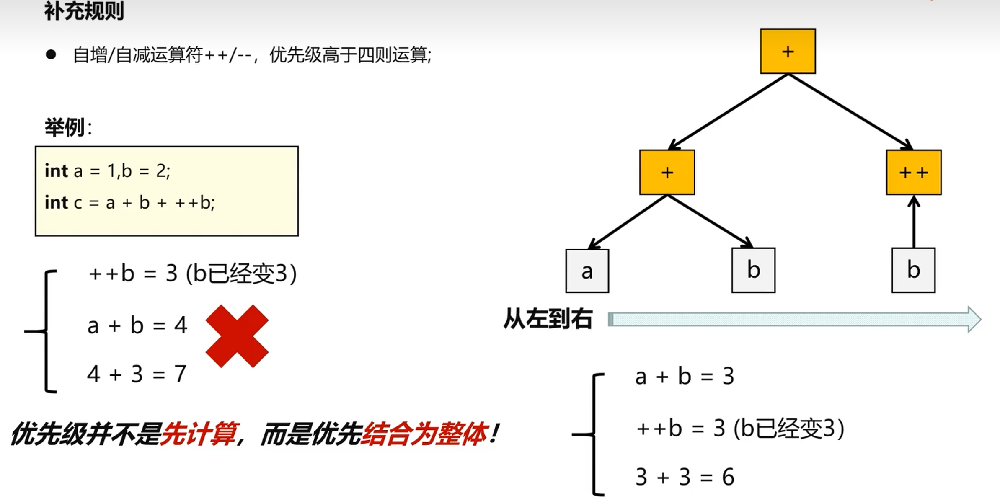

# 数据转换与运算

## 1. 数据类型转换

### 1.1 隐式转换

* 小取值范围类型可以隐式转换为大取值范围类型。

    

    注：取值范围不等价于字节大小，例如 `long` 类型数据的字节数大于 `float` 类型的字节数，但是 `float` 采用的是科学计数表示法，所以其取值范围大于 `long` 类型，固 `long` 类型数据可以隐式转换为 `float` 类型数据。

* **无符号**类型 不能接纳 **有符号**类型 数据。

* 取值范围小的数与取值范围大的数进行运算，取值范围小的数会先被隐式转换为取值范围大的数，再进行运算。

    注：byte、short、char进行运算时，会先隐式转换为 int 类型，最终得到一个int类型数据。

    ````c#
    byte a = 1;
    byte b= 2;
    
    byte c = a + b;//编译器会报错，因为 a+b 类型已经被提升为 int 类型了，无法隐式转换为byte
    Console.WriteLine(c);
    ````

### 1.2 强制转换

* 使用括号`()`强制转换。

    浮点型强制转换为整型时，小数部分会被直接抛弃，发生截断现象。

* 使用 `Convert.toXxx(data)`方法，可以将任意数据转换为任意类型，如果无法转换成功，则报错。

### 1.3 对象类型转换

* 使用 `as` 关键字，如果无法被转换，那么会转换成 null


## 2. 运算

### 2.1 自增自减

> 自增自减优先级问题



例：

```C#
int a = 1,b = 2,c = 3;
int d = a + b * c / 2 + ++a + a;
Console.WriteLine(d);//8
```

### 2.2 null 合并

> null 合并运算符。
>
> 对于一些可空基本类型进行可空判断，如果运算符左侧的数据为 null 则会返回运算符右侧的数据。

````c#
int? a = null;
Console.WriteLine(a ?? 2);
````

